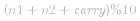
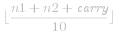
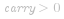
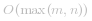

### 📺 视频题解  


### 📖 文字题解
#### 方法一：模拟

**思路与算法**

由于输入的两个链表都是**逆序**存储数字的位数的，因此两个链表中同一位置的数字可以直接相加。

我们同时遍历两个链表，逐位计算它们的和，并与当前位置的进位值相加。具体而言，如果当前两个链表处相应位置的数字为 *n1,n2*，进位值为  ，则它们的和为  ；其中，答案链表处相应位置的数字为  ，而新的进位值为  。

如果两个链表的长度不同，则可以认为长度短的链表的后面有若干个 *0* 。

此外，如果链表遍历结束后，有  ，还需要在答案链表的后面附加一个节点，节点的值为  。

**代码**

```C++ [sol1-C++]
class Solution {
public:
    ListNode* addTwoNumbers(ListNode* l1, ListNode* l2) {
        ListNode *head = nullptr, *tail = nullptr;
        int carry = 0;
        while (l1 || l2) {
            int n1 = l1 ? l1->val: 0;
            int n2 = l2 ? l2->val: 0;
            int sum = n1 + n2 + carry;
            if (!head) {
                head = tail = new ListNode(sum % 10);
            } else {
                tail->next = new ListNode(sum % 10);
                tail = tail->next;
            }
            carry = sum / 10;
            if (l1) {
                l1 = l1->next;
            }
            if (l2) {
                l2 = l2->next;
            }
        }
        if (carry > 0) {
            tail->next = new ListNode(carry);
        }
        return head;
    }
};
```

```Java [sol1-Java]
class Solution {
    public ListNode addTwoNumbers(ListNode l1, ListNode l2) {
        ListNode head = null, tail = null;
        int carry = 0;
        while (l1 != null || l2 != null) {
            int n1 = l1 != null ? l1.val : 0;
            int n2 = l2 != null ? l2.val : 0;
            int sum = n1 + n2 + carry;
            if (head == null) {
                head = tail = new ListNode(sum % 10);
            } else {
                tail.next = new ListNode(sum % 10);
                tail = tail.next;
            }
            carry = sum / 10;
            if (l1 != null) {
                l1 = l1.next;
            }
            if (l2 != null) {
                l2 = l2.next;
            }
        }
        if (carry > 0) {
            tail.next = new ListNode(carry);
        }
        return head;
    }
}
```

```JavaScript [sol1-JavaScript]
var addTwoNumbers = function(l1, l2) {
    let head = null, tail = null;
    let carry = 0;
    while (l1 || l2) {
        const n1 = l1 ? l1.val : 0;
        const n2 = l2 ? l2.val : 0;
        const sum = n1 + n2 + carry;
        if (!head) {
            head = tail = new ListNode(sum % 10);
        } else {
            tail.next = new ListNode(sum % 10);
            tail = tail.next;
        }
        carry = Math.floor(sum / 10);
        if (l1) {
            l1 = l1.next;
        }
        if (l2) {
            l2 = l2.next;
        }
    }
    if (carry > 0) {
        tail.next = new ListNode(carry);
    }
    return head;
};
```

```Golang [sol1-Golang]
func addTwoNumbers(l1, l2 *ListNode) (head *ListNode) {
    var tail *ListNode
    carry := 0
    for l1 != nil || l2 != nil {
        n1, n2 := 0, 0
        if l1 != nil {
            n1 = l1.Val
            l1 = l1.Next
        }
        if l2 != nil {
            n2 = l2.Val
            l2 = l2.Next
        }
        sum := n1 + n2 + carry
        sum, carry = sum%10, sum/10
        if head == nil {
            head = &ListNode{Val: sum}
            tail = head
        } else {
            tail.Next = &ListNode{Val: sum}
            tail = tail.Next
        }
    }
    if carry > 0 {
        tail.Next = &ListNode{Val: carry}
    }
    return
}
```

```C [sol1-C]
struct ListNode* addTwoNumbers(struct ListNode* l1, struct ListNode* l2) {
    struct ListNode *head = NULL, *tail = NULL;
    int carry = 0;
    while (l1 || l2) {
        int n1 = l1 ? l1->val : 0;
        int n2 = l2 ? l2->val : 0;
        int sum = n1 + n2 + carry;
        if (!head) {
            head = tail = malloc(sizeof(struct ListNode));
            tail->val = sum % 10;
            tail->next = NULL;
        } else {
            tail->next = malloc(sizeof(struct ListNode));
            tail->next->val = sum % 10;
            tail = tail->next;
            tail->next = NULL;
        }
        carry = sum / 10;
        if (l1) {
            l1 = l1->next;
        }
        if (l2) {
            l2 = l2->next;
        }
    }
    if (carry > 0) {
        tail->next = malloc(sizeof(struct ListNode));
        tail->next->val = carry;
        tail->next->next = NULL;
    }
    return head;
}
```

**复杂度分析**
- 时间复杂度： ，其中 *m,n* 为两个链表的长度。我们要遍历两个链表的全部位置，而处理每个位置只需要 *O(1)* 的时间。
- 空间复杂度： 。答案链表的长度最多为较长链表的长度 *+1*。