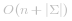
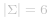

### 📺 视频题解  


### 📖 文字题解
#### 方法一：栈

判断括号的有效性可以使用「栈」这一数据结构来解决。

我们遍历给定的字符串 *s*。当我们遇到一个左括号时，我们会期望在后续的遍历中，有一个相同类型的右括号将其闭合。由于**后遇到的左括号要先闭合**，因此我们可以将这个左括号放入栈顶。

当我们遇到一个右括号时，我们需要将一个相同类型的左括号闭合。此时，我们可以取出栈顶的左括号并判断它们是否是相同类型的括号。如果不是相同的类型，或者栈中并没有左括号，那么字符串 *s* 无效，返回  。为了快速判断括号的类型，我们可以使用哈希表存储每一种括号。哈希表的键为右括号，值为相同类型的左括号。

在遍历结束后，如果栈中没有左括号，说明我们将字符串 *s* 中的所有左括号闭合，返回  ，否则返回  。

注意到有效字符串的长度一定为偶数，因此如果字符串的长度为奇数，我们可以直接返回  ，省去后续的遍历判断过程。

```C++ [sol1-C++]
class Solution {
public:
    bool isValid(string s) {
        int n = s.size();
        if (n % 2 == 1) {
            return false;
        }

        unordered_map<char, char> pairs = {
            {')', '('},
            {']', '['},
            {'}', '{'}
        };
        stack<char> stk;
        for (char ch: s) {
            if (pairs.count(ch)) {
                if (stk.empty() || stk.top() != pairs[ch]) {
                    return false;
                }
                stk.pop();
            }
            else {
                stk.push(ch);
            }
        }
        return stk.empty();
    }
};
```

```Java [sol1-Java]
class Solution {
    public boolean isValid(String s) {
        int n = s.length();
        if (n % 2 == 1) {
            return false;
        }

        Map<Character, Character> pairs = new HashMap<Character, Character>() {{
            put(')', '(');
            put(']', '[');
            put('}', '{');
        }};
        Deque<Character> stack = new LinkedList<Character>();
        for (int i = 0; i < n; i++) {
            char ch = s.charAt(i);
            if (pairs.containsKey(ch)) {
                if (stack.isEmpty() || stack.peek() != pairs.get(ch)) {
                    return false;
                }
                stack.pop();
            } else {
                stack.push(ch);
            }
        }
        return stack.isEmpty();
    }
}
```

```Python [sol1-Python3]
class Solution:
    def isValid(self, s: str) -> bool:
        if len(s) % 2 == 1:
            return False
        
        pairs = {
            ")": "(",
            "]": "[",
            "}": "{",
        }
        stack = list()
        for ch in s:
            if ch in pairs:
                if not stack or stack[-1] != pairs[ch]:
                    return False
                stack.pop()
            else:
                stack.append(ch)
        
        return not stack
```

```JavaScript [sol1-JavaScript]
var isValid = function(s) {
    const n = s.length;
    if (n % 2 === 1) {
        return false;
    }
    const pairs = new Map([
        [')', '('],
        [']', '['],
        ['}', '{']
    ]);
    const stk = [];
    s.split('').forEach(ch => {
        if (pairs.has(ch)) {
            if (!stk.length || stk[stk.length - 1] !== pairs.get(ch)) {
                return false;
            }
            stk.pop();
        } 
        else {
            stk.push(ch);
        }
    });
    return !stk.length;
};
```

```golang [sol1-Golang]
func isValid(s string) bool {
    n := len(s)
    if n % 2 == 1 {
        return false
    }
    pairs := map[byte]byte{
        ')': '(',
        ']': '[',
        '}': '{',
    }
    stack := []byte{}
    for i := 0; i < n; i++ {
        if pairs[s[i]] > 0 {
            if len(stack) == 0 || stack[len(stack)-1] != pairs[s[i]] {
                return false
            }
            stack = stack[:len(stack)-1]
        } else {
            stack = append(stack, s[i])
        }
    }
    return len(stack) == 0
}
```

```C [sol1-C]
char pairs(char a) {
    if (a == '}') return '{';
    if (a == ']') return '[';
    if (a == ')') return '(';
    return 0;
}

bool isValid(char* s) {
    int n = strlen(s);
    if (n % 2 == 1) {
        return false;
    }
    int stk[n + 1], top = 0;
    for (int i = 0; i < n; i++) {
        char ch = pairs(s[i]);
        if (ch) {
            if (top == 0 || stk[top - 1] != ch) {
                return false;
            }
            top--;
        } else {
            stk[top++] = s[i];
        }
    }
    return top == 0;
}
```

**复杂度分析**

- 时间复杂度：*O(n)*，其中 *n* 是字符串 *s* 的长度。

- 空间复杂度： ，其中   表示字符集，本题中字符串只包含 *6* 种括号， 。栈中的字符数量为 *O(n)*，而哈希表使用的空间为  ，相加即可得到总空间复杂度。