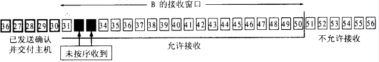
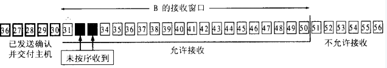
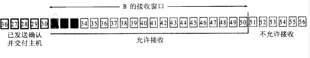
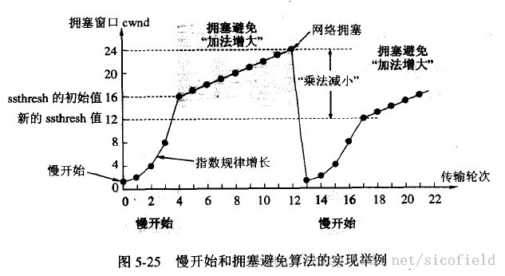
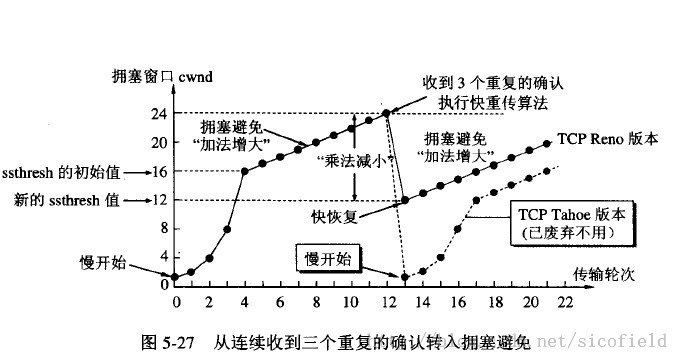

### TCP 协议如何保证可靠传输

- **确认和重传**：接收方收到报文就会确认，发送方发送一段时间后没有收到确认就重传。

- **数据校验**

- **数据合理分片和排序**：

  - UDP:IP数据报大于1500字节,大于MTU.这个时候发送方IP层就需要分片(fragmentation).把数据报分成若干片,使每一片都小于MTU.而接收方IP层则需要进行数据报的重组.这样就会多做许多事情,而更严重的是,由于UDP的特性,当某一片数据传送中丢失时,接收方便无法重组数据报.将导致丢弃整个UDP数据报.

  - TCP会按MTU合理分片，接收方会缓存未按序到达的数据，重新排序后再交给应用层。

- **流量控制**: 当接收方来不及处理发送方的数据，能提示发送方降低发送的速率，防止包丢失。
- **拥塞控制**: 当网络拥塞时，减少数据的发送。

### 滑动窗口

- 上面笼统地说了 TCP 保证可靠传输的机制，下面说说如何用滑动窗口来实现。

#### 为什么要使用滑动窗口

因为发送端希望在收到确认前，继续发送其它报文段。比如说在收到0号报文的确认前还发出了1-3号的报文，这样提高了信道的利用率。但可以想想，0-4发出去后可能要重传，所以需要一个缓冲区维护这些报文，所以就有了窗口。

RTT：往返时间。

#### 窗口是什么

#### 接收窗口：

 　　

- “接收窗口”大小取决于应用（比如说tomcat：8080端口的监听进程）、系统、硬件的限制。图中，接收窗口是31~50，大小为20。

- 在接收窗口中，黑色的表示已收到的数据，白色的表示未收到的数据。

- 当收到窗口左边的数据，如27，则丢弃，因为这部分已经交付给主机；

- 当收到窗口右边的数据，如52，则丢弃，因为还没轮到它；

- 当收到已收到的窗口中的数据，如32，丢弃；

- 当收到未收到的窗口中的数据，如35，缓存在窗口中。

#### 发送窗口：

- 发送窗口的大小swnd=min（rwnd，cwnd）。rwnd是接收窗口，cwnd用于拥塞控制，暂时可以理解为swnd= rwnd =20。

- 图中分为四个区段，其中P1到P3是发送窗口。

tips：发送窗口以字节为单位。为了方便画图，图中展示得像以报文为单位一样。但这不影响理解。

### 重传和确认

#### 什么时候发确认

- 这是一个复杂的策略。我们这里先简单地认为每收到一个报文就发一个确认。

#### 怎么确认（累计确认）：

情况1：发送ack=31（为什么这个也要发，这个确认可以用于后面的拥塞控制）

情况2：发送ack=34，并把接收窗口左边缘设置成34，右边缘设置成53

累计确认的好处：情况1中ack=31比描述收到32和33简单；坏处：可能要重传已经接收的数据。

#### 发送方收到确认时怎么处理：

情况1：收到ack=31，什么都不做，或者说继续发送可用窗口中的内容，如42~50

情况2：收到ack=34，发送窗口窗口的左边缘设置成34，右边缘设置成53

#### 什么时候重传：因为每个报文都有超时计数器，超时才重传。超时重传时间的选择也是一个策略。

tcp缓存和窗口的关系：窗口是缓存的一部分。

发送缓存=发送窗口+ P3右边的一部分

接收缓存=接收窗口+部分已确认但主机还没处理完的数据。

### 流量控制

一图流，简单来说就是接收方处理不过来的时候，就把窗口缩小，并把窗口值告诉发送端。

当窗口值为0，而接受方把窗口值恢复（比如ACK=1，ack=601，rwnd=200），但确认丢失，进入相互等待的死锁局面。所以如果窗口值为0，发送端就会开启一个持续计数器，每个一段时间询问一下接收方。

### 拥塞控制

swnd=min（rwnd，cwnd），cwnd就是拥塞窗口大小。

#### 慢开始和拥塞避免

- ssthresh：处理拥塞时参照的一个参数。例子中初始值为16，后来变为12。

- 当cwnd> ssthresh，cwnd以慢开始的方法指数增长；

- 当cwnd< ssthresh，cwnd以拥塞避免的方法线性增长。

__值得注意的几个点:__

- 上图是cwnd随传输轮次的变化，每过一个RTT就算一轮。

- 超时就可以认为是拥塞了

#### 快重传和快恢复：上一个算法的加强版

- 快重传：收到3个同样的确认就立刻重传，不等到超时；

- 快恢复：cwnd不是从1重新开始。