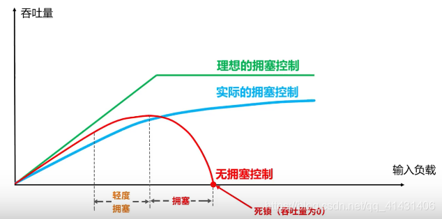
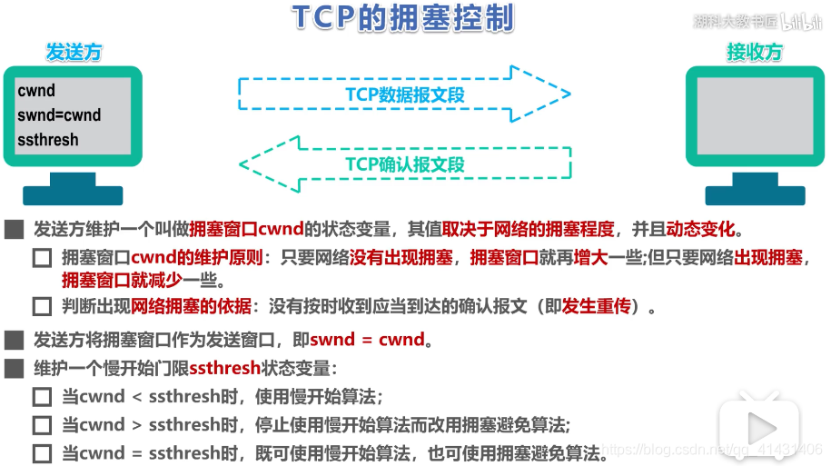
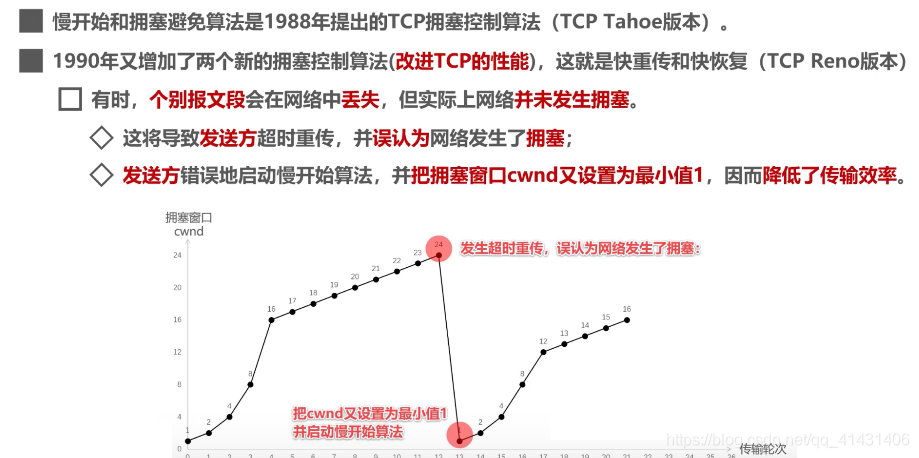
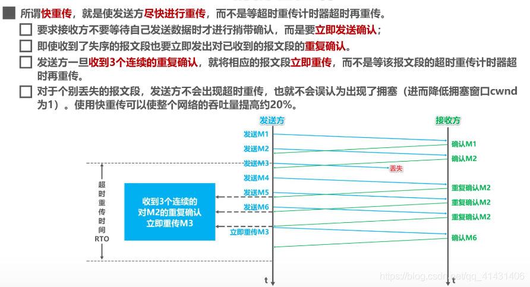
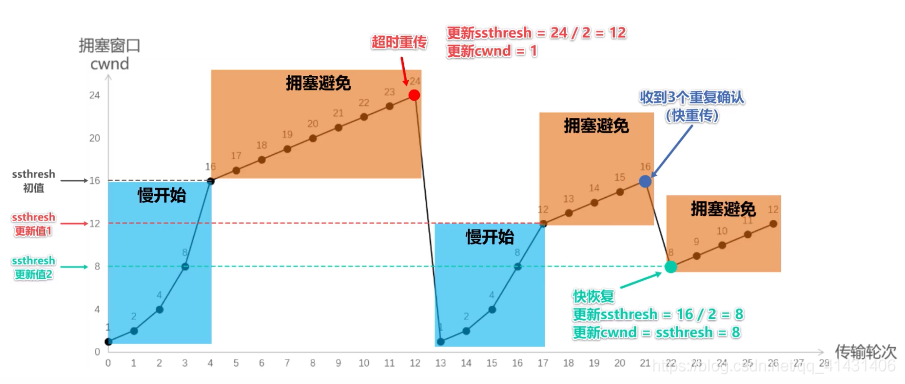

### TCP 协议如何保证可靠传输

- **确认和重传**：接收方收到报文就会确认，发送方发送一段时间后没有收到确认就重传。

- **数据校验**

- **数据合理分片和排序**：

- **流量控制**: 当接收方来不及处理发送方的数据，能提示发送方降低发送的速率，防止包丢失。
- **拥塞控制**: 当网络拥塞时，减少数据的发送。

## TCP的拥塞控制

在某段时间，若对网络中某一资源的需求超过了该资源所能提供的可用部分，网络性能就要变坏，这种情况就叫做网络拥塞。

在计算机网络中数位链路容量（即带宽）、交换结点中的缓存和处理机等，都是网络的资源。

若出现拥塞而不进行控制，整个网络的吞吐量将随输入负荷的增大而下降。

当输入的负载到达一定程度 吞吐量不会增加，即一部分网络资源会丢失掉，网络的吞吐量维持在其所能控制的最大值，转发节点的缓存不够大这造成分组的丢失是拥塞的征兆。
### TCP的四种拥塞控制算法
- 慢开始
- 拥塞控制
- 快重传
- 快恢复

传输轮次：发送方给接收方发送数据报文段后，接收方给发送方发回相应的确认报文段，一个传输轮次所经历的时间就是往返时间RTT(RTT并非是恒定的数值），使用传输轮次是为了强调，把拥塞窗口cwnd所允许发送的报文段都连续发送出去，并收到了对已发送的最后一个报文段的确认，拥塞窗口cwnd会随着网络拥塞程度以及所使用的拥塞控制算法动态变化。

在tcp双方建立逻辑链接关系时， 拥塞窗口cwnd的值被设置为1，还需设置慢开始门限ssthresh,在执行慢开始算法时，发送方每收到一个对新报文段的确认时，就把拥塞窗口cwnd的值加一，然后开始下一轮的传输，当拥塞窗口cwnd增长到慢开始门限值时，就使用拥塞避免算法。

### 慢开始

假设当前发送方拥塞窗口cwnd的值为1，而发送窗口swnd等于拥塞窗口cwnd，因此发送方当前只能发送一个数据报文段（拥塞窗口cwnd的值是几，就能发送几个数据报文段），接收方收到该数据报文段后，给发送方回复一个确认报文段，发送方收到该确认报文后，将拥塞窗口的值变为2，

发送方此时可以连续发送两个数据报文段，接收方收到该数据报文段后，给发送方一次发回2个确认报文段，发送方收到这两个确认报文后，将拥塞窗口的值加2变为4，发送方此时可连续发送4个报文段，接收方收到4个报文段后，给发送方依次回复4个确认报文，发送方收到确认报文后，将拥塞窗口加4，置为8，发送方此时可以连续发送8个数据报文段，接收方收到该8个数据报文段后，给发送方一次发回8个确认报文段，发送方收到这8个确认报文后，将拥塞窗口的值加8变为16，

当前的拥塞窗口cwnd的值已经等于慢开始门限值，之后改用拥塞避免算法。

### 避免拥塞

也就是每个传输轮次，拥塞窗口cwnd只能线性加一，而不是像慢开始算法时，每个传输轮次，拥塞窗口cwnd按指数增长。同理，16+1……直至到达24，假设24个报文段在传输过程中丢失4个，接收方只收到20个报文段，给发送方依次回复20个确认报文段，一段时间后，丢失的4个报文段的重传计时器超时了，发送发判断可能出现拥塞，更改cwnd和ssthresh.并重新开始慢开始算法，如图所示：

---

### 快速重传

发送方发送1号数据报文段，接收方收到1号报文段后给发送方发回对1号报文段的确认，在1号报文段到达发送方之前，发送方还可以将发送窗口内的2号数据报文段发送出去，接收方收到2号报文段后给发送方发回对2号报文段的确认，在2号报文段到达发送方之前，发送方还可以将发送窗口内的3号数据报文段发送出去，

假设该报文丢失，接受方便不会发送针对该报文的确认报文给发送方，发送方还可以将发送窗口内的4号数据报文段发送出去；接收方收到后，发现这不是按序到达的报文段，因此给发送方发送针对2号报文段的重复确认，表明我现在希望收到的是3号报文段，但是我没有收到3号报文段，而收到了未按序到达的报文段，发送方还可以将发送窗口中的5号报文段发送出去,接收方收到后，发现这不是按序到达的报文段，因此给发送方发送针对2号报文段的重复确认，
表明我现在希望收到的是3号报文段，但是我没有收到3号报文段，而收到了未按序到达的报文段,，发送方还可以将发送窗口内的最后一个数据段即6号数据报文段发送出去，接收方收到后，发现这不是按序到达的报文段，因此给发送方发送针对2号报文段的重复确认，表明我现在希望收到的是3号报文段，但是我没有收到3号报文段，而收到了未按序到达的报文段，

此时，**发送方收到了累计3个连续的针对2号报文段的重复确认**，立即重传3号报文段，接收方收到后，给发送方发回针对6号报文的确认，表明，序号到6为至的报文都收到了，这样就不会造成发送方对3号报文的超时重传，而是提早收到了重传。

### 快速恢复

