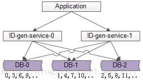
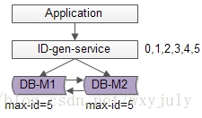
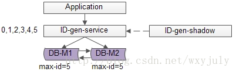
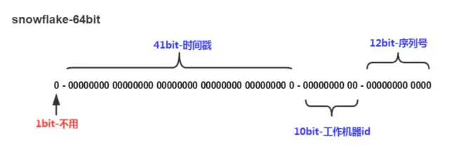

## 使用数据库的 auto_increament 来生成

### 优点
- 此方法使用数据库原有的功能，所以相对简单
- 能够保证唯一性
- 能够保证递增性
- id 之间的步长是固定且可自定义的

### 缺点

- 可用性难以保证：数据库常见架构是 一主多从 + 读写分离，生成自增ID是写请求 主库挂了就玩不转了
- 扩展性差，性能有上限：因为写入是单点，数据库主库的写性能决定ID的生成性能上限，并且 难以扩展

#### 改进方案

- 冗余主库，避免写入单点
- 数据库水平切分，保证各主库生成的ID不重复

由 1 个写库变成 3 个写库， 每个写库设置不同的auto_increment初始值，以及相同的增长步长 ，以保证每个数据库生成的 ID 是不同的（上图中库 0 生成 0,3,6,9… ，库 1 生成 1,4,7,10 ，库 2 生成 2,5,8,11… ）

- 丧失类了ID生成的绝对递增性：先访问库0生成0,3，再访问库1生成1，可能导致在非常短的时间内，ID生成不是绝对递增的（这个问题不大，我们的目标是趋势递增，不是绝对递增）

- 数据库的写压力依然很大，每次生成ID都要访问数据库

------

## 单点批量ID生成服务

分布式系统之所以难，很重要的原因之一是“没有一个全局时钟，难以保证绝对的时序”，要想保证绝对的时序，还是只能使用单点服务，用本地时钟保证“绝对时序”。数据库写压力大，是因为每次生成ID都访问了数据库，可以使用批量的方式降低数据库写压力。

### 优点

- 保证了ID生成的绝对递增有序

- 大大的降低了数据库的压力，ID生成可以做到每秒生成几万几十万个

### 缺点

- 服务仍然是单点

- 如果服务挂了，服务重启起来之后，继续生成ID可能会不连续，中间出现空洞（服务内存是保存着0,1,2,3,4,5，数据库中max-id是5，分配到3时，服务重启了，下次会从6开始分配，4和5就成了空洞，不过这个问题也不大）

- 虽然每秒可以生成几万几十万个ID，但毕竟还是有性能上限，无法进行水平扩展
#### 改进方案

## uuid

上述方案来生成ID，虽然性能大增，但由于是单点系统，总还是存在性能上限的。同时，上述两种方案，不管是数据库还是服务来生成ID，业务方Application都需要进行一次远程调用，比较耗时。有没有一种本地生成ID的方法，即高性能，又时延低呢？

uuid是一种常见的方案：string ID =GenUUID();

### 优点

- 本地生成ID，不需要进行远程调用，时延低

- 扩展性好，基本可以认为没有性能上限

### 缺点：

- 无法保证趋势递增

- uuid过长，往往用字符串表示，作为主键建立索引查询效率低，常见优化方案为“转化为两个uint64整数存储”或者“折半存储”（折半后不能保证唯一性）

----

## 取当前毫秒数

uuid是一个本地算法，生成性能高，但无法保证趋势递增，且作为字符串ID检索效率低，有没有一种能保证递增的本地算法呢？

取当前毫秒数是一种常见方案：uint64 ID = GenTimeMS();

### 优点

- 本地生成ID，不需要进行远程调用，时延低

- 生成的ID趋势递增

- 生成的ID是整数，建立索引后查询效率高

### 缺点：

- 如果并发量超过1000，会生成重复的ID

---- 

## snowflake算法

### snowflake是twitter开源的分布式ID生成算法，其核心思想是：

- 一个long型的ID，使用其中41bit作为毫秒数，10bit作为机器编号，12bit作为毫秒内序列号。这个算法单机每秒内理论上最多可以生成1000*(2^12)，也就是400W的ID，完全能满足业务的需求。

- 41位为时间戳,12位为在这一刻能够产生2^12个自增的Id这结合了自增Id的优势,同时10位机器ID(dataCenterId 5位和machineId 5位)确保了分布式能够支持1024台节点

Twitter 的分布式雪花算法 SnowFlake 每秒自增生成26个万可排序的ID:

- twitter 的`SnowFlake生成ID能够按照时间有序生成`
- SnowFlake算法生成id的结果是一个`64bit`大小的整数
- `分布式系统内不会产生重复id`（用有**datacenterId**和**machineId**来做区分）datacenterId（分布式）(服务ID 1，2，3.....)每个服务中写死 machineId（用于集群） 机器ID 读取机器的环境变量`MACHINEID` 部署时每台服务器ID不一样。

### 缺点
- 强依赖时钟,如果主机时间回拨,则会造成重复ID
