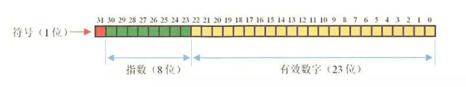
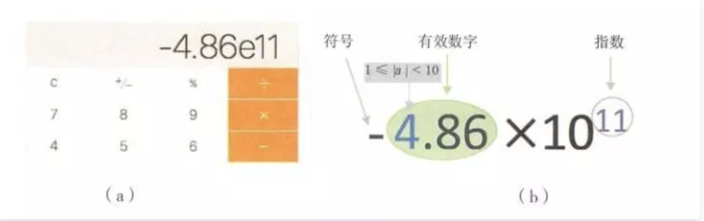
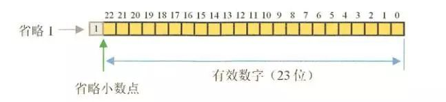

###为何浮点数可能丢失精度

在工作中，谈到有小数点的加减乘除都会想到用BigDecimal来解决，但是有很多人对于double或者float为啥会丢失精度一脸茫然。还有BigDecimal是怎么解决的？话不多说，我们开始。

1.浮点数是啥？

浮点数是计算机用来表示小数的一种数据类型，采用科学计数法。在java中，double是双精度，64位，浮点数，默认是0.0d。float是单精度，32位.浮点数，默认是0.0f；

#### 在内存中存储



float 符号位(1bit) 指数(8 bit) 尾数(23 bit)

double 符号位(1bit) 指数(11 bit) 尾数(52 bit)

float在内存中占8位，由于阶码实际存储的是指数的移码，假设指数的真值是e,阶码为E，则有E=e+(2^n-1 -1)。其中 2^n-1 -1是IEEE754标准规定的指数偏移量，根据这个公式我们可以得到 2^8 -1=127。于是，float的指数范围为-128 +127，而double的指数范围为-1024 +1023。其中负指数决定了浮点数所能表达的绝对值最小的非零数；而正指数决定了浮点数所能表达的绝对值最大的数，也即决定了浮点数的取值范围。

loat的范围为-2^128 ~ +2^127，也即-3.40E+38 ~ +3.40E+38；

double的范围为-2^1024 ~ +2^1023，也即-1.79E+308 ~ +1.79E+308

### 2.走进失真之科学计数法

我们先说说科学计数法，科学计数法是一种简化计数的方法，用来近似表示一个极大或极小且位数较多的数，对于位数较小的数值，科学计数法没有什么优势，但对于位数较多的数值其计数方法的优势就非常明显了。例如：光的速速是300000000米/秒，全世界人口数大约是6100000000。类似光的速度和世界人口数这样大数值的数，读、写都很不方便，所以光的速度可以写成3*10^8，全世界人口数可以写成6.1*10^9。所以计算器用科学计数法表示光速是3E8，世界人口数大约是6.1E9。

我们小时候玩计算器喜欢疯狂的累加或者累减，到最后计算器就会显示下图。这个就是科学计数法显示的结果



那图中真实的值是 -4.86*10^11=-486000000000。十进制科学计数法要求有效数字的整数部分必须在【1，9】区间内。

### 3.走进失真之精度

计算机在处理数据都涉及到数据的转换和各种复杂运算，比如，不同单位换算，不同进制（如二进制十进制）换算等，很多除法运算不能除尽，比如10÷3=3.3333.....无穷无尽，而精度是有限的，3.3333333x3并不等于10，经过复杂的处理后得到的十进制数据并不精确，精度越高越精确。
- float和double的精度是由尾数的位数来决定的,其整数部分始终是一个隐含着的“1”，由于它是不变的，故不能对精度造成影响。
- float：2^23 = 8388608，一共七位，由于最左为1的一位省略了，这意味着最多能表示8位数：28388608 = 16777216 。
有8位有效数字，但绝对能保证的为7位，也即float的精度为7~8位有效数字；double：2^52 = 4503599627370496，一共16位，同理，double的精度为16~17位。



当到达一定值自动开始使用科学计数法，并保留相关精度的有效数字，所以结果是个近似数,并且指数为整数。在十进制中小数有些是无法完整用二进制表示的。所以只能用有限位来表示，从而在存储时可能就会有误差。对于十进制的小数转换成二进制采用乘2取整法进行计算，取掉整数部分后，剩下的小数继续乘以2,直到小数部分全为0。

````text
输出是 0.19999999999999998
double类型 0.3-0.1的情况。需要将0.3转成二进制在运算
0.3 * 2 = 0.6 => .0 (.6)取0剩0.6
0.6 * 2 = 1.2 => .01 (.2)取1剩0.2
0.2 * 2 = 0.4 => .010 (.4)取0剩0.4
0.4 * 2 = 0.8 => .0100 (.8) 取0剩0.8
0.8 * 2 = 1.6 => .01001 (.6)取1剩0.6
````
4.那我们怎么用BigDecimal来解决？

大家看下面的两个输出


输出结果：

0.299999999999999988897769753748434595763683319091796875

0.3

阿里的代码约束插件在图表上已经标记了警告，所以让我使用String字符串参数的构造方法创建BigDecimal。

由于double不能精确表示为0.3（任何有限长度的二进制），因此用double构造函数传递的值不完全等于0.3。

使用bigdecimal时，必须使用String字符串参数构造方法来创建它。

在这一点上，有没有好奇的疑问。BigDecimal原理是什么？为什么它就没事？原理很简单。

BigDecimal是不可变的，可以用来表示任意精度的带符号十进制数。double的问题是从小数点转换到二进制丢失精度，二进制丢失精度。BigDecimal在处理的时候把十进制小数扩大N倍让它在整数上进行计算，并保留相应的精度信息。至于BigDecimal是怎么保存的可以翻阅一下源代码。

3.总结

从上面看，很清楚为什么浮点数有精度问题。简单地说，float和double类型主要是为科学计算和工程计算而设计的。它们执行二进制浮点运算，这些运算经过精心设计，能够在广泛的数值范围内提供更精确的快速近似和计算而精心设计的。但是，它们不能提供完全准确的结果，因此不能用于需要计算精确结果的场景中。当浮点数达到一定的大数时自动使用科学计数法。这样的表示只是近似真实数而不等于真实数。当十进制小数转换为二进制时，也会出现无限循环或超出浮点数尾部的长度。
