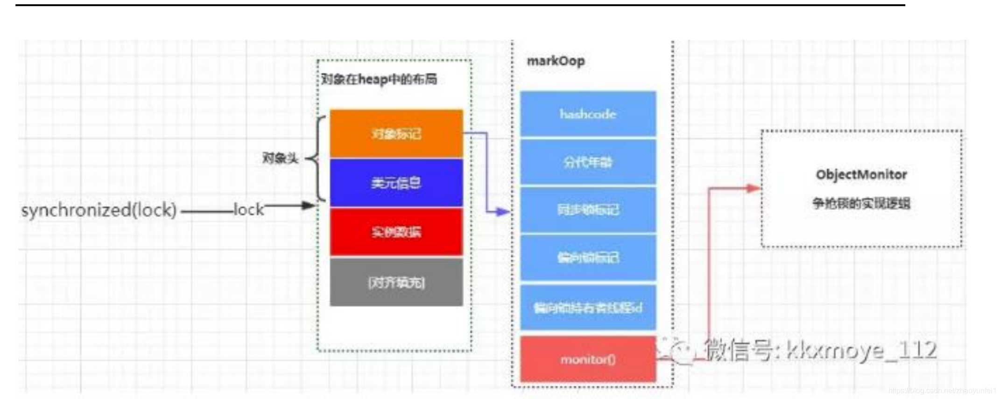
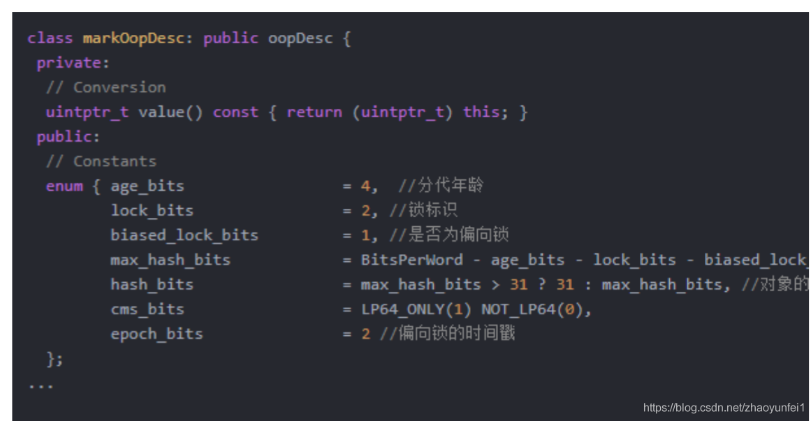
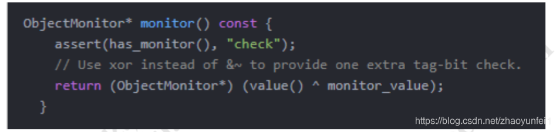
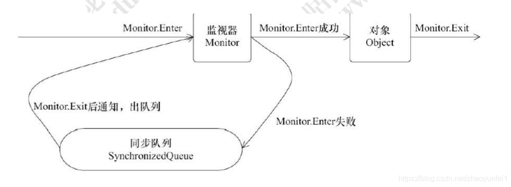
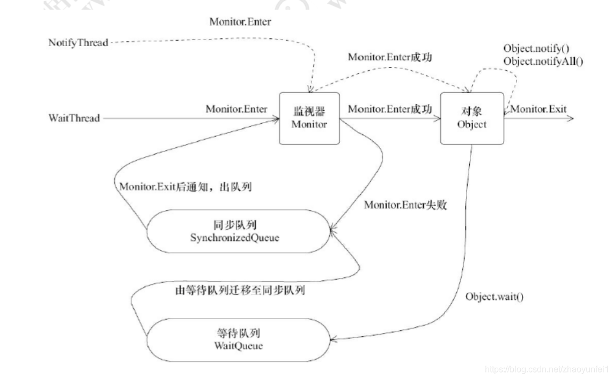

### synchronized 有三种方式来加锁

- 修饰实例方法，作用于当前实例加锁，进入同步代码前 要获得当前实例的锁

- 静态方法，作用于当前类对象加锁，进入同步代码前要 获得当前类对象的锁

- 修饰代码块，指定加锁对象，对给定对象加锁，进入同 步代码库前要获得给定对象的锁。 不同的修饰类型，代表锁的控制粒度

### 思考锁是如何存储的

可以思考一下，要实现多线程的互斥特性，那这把锁需要 哪些因素？

- 锁需要有一个东西来表示，比如获得锁是什么状态、无锁状态是什么状态

- 这个状态需要对多个线程共享

那么我们来分析，synchronized 锁是如何存储的呢？观察 synchronized 的整个语法发现，synchronized(lock)是基于 lock 这个对象的生命周期来控制锁粒度的，那是不是锁的 存储和这个 lock 对象有关系呢？ 于是我们以对象在 jvm 内存中是如何存储作为切入点，去 看看对象里面有什么特性能够实现锁

### 对象在内存中的布局 

在 Hotspot 虚拟机中，对象在内存中的存储布局，可以分 为三个区域:对象头(Header)、实例数据(Instance Data)、对 齐填充(Padding) 



- Mark Word(标记字段):对象的Mark Word部分占4个字节，其内容是一系列的标记位，比如轻量级锁的标记位，偏向锁标记位等等。
- Klass Pointer（Class对象指针）:Class对象指针的大小也是4个字节，其指向的位置是对象对应的Class对象（其对应的元数据对象）的内存地址
- 对象实际数据:这里面包括了对象的所有成员变量，其大小由各个成员变量的大小决定，比如：byte和boolean是1个字节，short和char是2个字节，int和float是4个字节，long和double是8个字节，reference是4个字节
- 对齐:最后一部分是对齐填充的字节，按8个字节填充。

###  探究 Jvm 源码实现

当我们在 Java 代码中，使用 new 创建一个对象实例的时 候，（hotspot 虚拟机）JVM 层面实际上会创建一个 instanceOopDesc 对象。Hotspot 虚拟机采用 OOP-Klass 模型来描述 Java 对象实 例，OOP(Ordinary Object Point)指的是普通对象指针， Klass 用来描述对象实例的具体类型。Hotspot 采用 instanceOopDesc 和 arrayOopDesc 来 描述对象 头， arrayOopDesc 对象用来描述数组类型，从 instanceOopDesc 代码中可以看到 instanceOopDesc 继承自 oopDesc，oopDesc 的定义载 Hotspot 源码中的 oop.hpp 文件中 在普通实例对象中，oopDesc 的定义包含两个成员，分别 是 _mark 和 _metadata，_mark 表示对象标记、属于 markOop 类型，也就是接下来 要讲解的 Mark World，它记录了对象和锁有关的信息，_metadata 表示类元信息，类元信息存储的是对象指向它 的类元数据(Klass)的首地址，其中 Klass 表示普通指针、 _compressed_klass 表示压缩类指针

### MarkWord



Mark word 记录了对象和锁有关的信息，当某个对象被 synchronized 关键字当成同步锁时，那么围绕这个锁的一 系列操作都和 Mark word 有关系。Mark Word 在 32 位虚 拟机的长度是 32bit、在 64 位虚拟机的长度是 64bit。 Mark Word 里面存储的数据会随着锁标志位的变化而变化， Mark Word 可能变化为存储以下 5 中情况

### 为什么任何对象都可以实现锁 

首先，Java 中的每个对象都派生自 Object 类，而每个 Java Object 在 JVM 内部都有一个 native 的 C++对象 oop/oopDesc 进行对应。 2. 线程在获取锁的时候，实际上就是获得一个监视器对象 (monitor) ,monitor 可以认为是一个同步对象，所有的 Java 对象是天生携带 monitor。在 hotspot 源码的 markOop.hpp 文件中，可以看到下面这段代码。



多个线程访问同步代码块时，相当于去争抢对象监视器 修改对象中的锁标识,上面的代码中ObjectMonitor这个 对象和线程争抢锁的逻辑有密切的关系

###重量级锁的加锁的基本流程 
任意线程对 Object（Object 由 synchronized 保护）的访 问，首先要获得 Object 的监视器。如果获取失败，线程进 入同步队列，线程状态变为 BLOCKED。当访问 Object 的 前驱（获得了锁的线程）释放了锁，则该释放操作唤醒阻 塞在同步队列中的线程，使其重新尝试对监视器的获取。



### 回顾线程的竞争机制 

再来回顾一下线程的竞争机制对于锁升级这块的一些基本 流程。方便大家更好的理解 加入有这样一个同步代码块，存在 Thread#1、Thread#2 等 多个线程
````java
synchronized (lock) {
// do something
}
````
情况一：只有 Thread#1 会进入临界区；

情况二：Thread#1 和 Thread#2 交替进入临界区,竞争不激 烈；

情况三：Thread#1/Thread#2/Thread3… 同时进入临界区， 竞争激烈

偏向锁
此时当 Thread#1 进入临界区时，JVM 会将 lockObject 的 对象头 Mark Word 的锁标志位设为“01”，同时会用 CAS 操 作把 Thread#1 的线程 ID 记录到 Mark Word 中，此时进 入偏向模式。所谓“偏向”，指的是这个锁会偏向于 Thread#1， 若接下来没有其他线程进入临界区，则 Thread#1 再出入 临界区无需再执行任何同步操作。也就是说，若只有 Thread#1 会进入临界区，实际上只有 Thread#1 初次进入 临界区时需要执行 CAS 操作，以后再出入临界区都不会有 同步操作带来的开销。

轻量级锁
偏向锁的场景太过于理想化，更多的时候是 Thread#2 也 会尝试进入临界区， 如果 Thread#2 也进入临界区但是 Thread#1 还没有执行完同步代码块时，会暂停 Thread#1 并且升级到轻量级锁。Thread#2 通过自旋再次尝试以轻量 级锁的方式来获取锁

重量级锁
如果 Thread#1 和 Thread#2 正常交替执行，那么轻量级锁 基本能够满足锁的需求。但是如果 Thread#1 和 Thread#2 同时进入临界区，那么轻量级锁就会膨胀为重量级锁，意 味着 Thread#1 线程获得了重量级锁的情况下，Thread#2 就会被阻塞

### Synchronized 结合 Java Object 对象中的 wait,notify,notifyAll 

前面我们在讲 synchronized 的时候，发现被阻塞的线程什 么时候被唤醒，取决于获得锁的线程什么时候执行完同步 代码块并且释放锁。那怎么做到显示控制呢？我们就需要 借 助 一 个 信 号 机 制 ： 在 Object 对 象 中 ， 提 供 了 wait/notify/notifyall，可以用于控制线程的状态

wait/notify/notifyall 基本概念
wait：表示持有对象锁的线程 A 准备释放对象锁权限，释 放 cpu 资源并进入等待状态。

notify：表示持有对象锁的线程 A 准备释放对象锁权限，通 知 jvm 唤 醒 某 个 竞 争 该 对 象 锁 的 线 程 X 。 线 程 A synchronized 代码执行结束并且释放了锁之后，线程 X 直 接获得对象锁权限，其他竞争线程继续等待(即使线程 X 同 步完毕，释放对象锁，其他竞争线程仍然等待，直至有新 的 notify ,notifyAll 被调用)。

notifyAll：notifyall 和 notify 的区别在于，notifyAll 会唤醒 所有竞争同一个对象锁的所有线程，当已经获得锁的线程 A 释放锁之后，所有被唤醒的线程都有可能获得对象锁权 限

需要注意的是：三个方法都必须在 synchronized 同步关键 字 所 限 定 的 作 用 域 中 调 用 ， 否 则 会 报 错 java.lang.IllegalMonitorStateException ，意思是因为没有 同步，所以线程对对象锁的状态是不确定的，不能调用这 些方法。 另外，通过同步机制来确保线程从 wait 方法返回时能够感 知到感知到 notify 线程对变量做出的修改

### wait/notify 的基本原理

