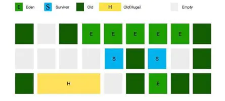

### 1.G1的回收原理是什么？为什么G1比传统的GC回收性能好？
### 2.为什么G1如此完美仍然会有ZGC？

####简单的回顾下CMS垃圾回收机制，下面介绍了一个极端的场景（而且是经常发生的）

- 在发生Minor GC时，由于Survivor区已经放不下了，多出的对象只能提升（Promotion）到老年代。但是此时老年代因为空间碎片的缘故，会发生**Concurrent mode failure**的错误。
这个时候，就需要降级为Serial Old垃圾回收器进行收集。这就是比 **concurrent mode failure** 更加严重的**promotion[晋升] failed**的问题。

- 一个简单的Minor，竟然能演化成耗时最长的Full GC。最要命的是，这个停顿时间是不可预知的。

### 有没有一种方法，能够首先定义一个停顿时间，然后反向推算收集内容呢？

- 我们要求G1，在任意1秒的时间内，停顿不得超过10ms，这就是在给它制定KPI。G1会尽量达成这个目标，它能够推算出本次要收集的大体区域，以增量的方式完成收集。
这也是使用G1垃圾回收器不得不设置的一个参数：`-XX:MaxGCPauseMilis=10`

###为什么叫G1？

- G1的目标是用来干掉CMS的，它同样是一款软实时垃圾回收器。相比CMS，G1的使用更加人性化。比如，CMS垃圾回收器的相关参数有72个，而G1的参数只有26个。
- G1的全称是GarbageFirst GC，为了达成上面制定的KPI，它和前面介绍的垃圾回收器，在对堆的划分上有一些不同。 其它的回收器，都是对某个年代的整体收集，收集时间上自然不好控制。G1把堆切成了很多份，把每一份当作一个小目标，每一份收集时间自然是很好控制的。

### 那么题又来了：G1有年轻代和老年代区分吗？

- 如图所示，G1也是有Eden区和Survivor区的概念的，只不过它们在内存上不是连续的，而是由一小份一小份组成的。
- 这一小份区域的大小是固定的，名字叫做 **小堆区（Region)**。小堆区可以是Eden也可以是Survivor区，还可以是Old区，**所以G1的年轻代和老年代的概念都是逻辑上的**。
- 每一块Region，大小都是一致的，它的数值在1M-32M字节之间的一个2的幂值数。
0 但假如我的对象太大，一个Region放不下怎们办？注意图中有一块很大的黄色区域，叫**Humongous Region，大小超过Region 50%的对象，将会在这里分配**。
- Region的大小，可以通过参数进行设置：`-XX:G1HeapRegionSize=<N>M`

####那么回收的时候，到底回收那些小堆区呢？是随机的吗？

- 垃圾最多的小堆区，会被优先回收，这也是G1名字的由来。

### G1 的垃圾回收过程

在逻辑上，G1分为年轻代和老年代，但是它的比例并不是那么"固定"，为了达到MaxGCPauseMillis所规定的效果，G1会自动调整两者之间的比例。
如果你强行使用-Xmn或者-XX:NewRatio去设定它们的比例的话，我们给G1设定的这个目标将会失效。

#### G1的回收过程主要分为3类：
- G1年轻代的垃圾回收，同样叫Minor GC ，这个过程和我们前面描述的类似，发生时机就是Eden区满的时候。
- __老年代的垃圾回收，严格上来说其实不算是回收，它是一个并发标记的过程，顺便清理一点点对象。__
- __真正的清理，发生在"混合模式"，它不只清理年轻代，还会将老年代的一部分区域进行清理。__

### 三种回收分类

在GC日志里，这个过程描述特别有意思 （1）的过程，叫作[GC pause(G1 Evacuation Pause)(Young)]，而（2）的过程，叫做[GC pause(G1 Evacuation Pause)(Mixed)]。Evacuation是转移的意思，和Copy的意思有点类似。
这三种模式之间的间隔也是不固定的。比如，1次Minor GC之后，发生了一次并发标记，接着发生了9次Mixed GC。

### RSet
- RSet是一个空间换时间的数据结构。

- 之前提到过一个卡表的数据结构，用来解决跨代引用的问题。RSet的功能与此类似，它的全称是**Remembered Set**，用于记录和维护Region之间的对象引用关系。

- RSet和Card Table有些不同的地方: Card Table 是一种Points-out（我引用了谁的对象）的结构，而RSet记录了其他Region中的对象引用本Region中对象的关系属于Points-into(谁引用了我的对象)，像是倒排索引。
可以把RSet理解成一个Hash，key是引用了我（对象）的Region的地址，value是引用它的对象的卡页集合。

- __有了这个数据结构，在回收某个Region的时候，就不必对整个堆内存的对象进行扫描了。它使得部分回收变成可行。__

- 对年轻代的Region。它的RSet只保存了来自老年代的引用，这是因为年轻代的回收是针对所有年轻代Region的。所以年轻代Region的RSet有可能是空的。
- 对于老年代的Region来说，它的RSet也只是保存老年代对它的引用。这是因为老年代回收之前，会先对年轻代进行回收。这时，Eden区变空了，而在回收过程中会扫描Survivor分区，所以也没必要保存来自年轻代的引用。
- RSet通常会占用很大的空间，大约5%或者更高。不仅仅是空间方面，很多计算开销也是比较大的。
- 事实上，为了维护RSet，程序运行的过程中，写入某个字段就会产生一个post-write barrier。为了减少这个开销，将内容放入RSet的过程是异步的，而且经过了很多的优化：Write Barrier 把脏卡信息存放到本地缓冲区（local buffer），有专门的的GC线程负责回收，并将相关信息传给Region的RSet。

### 具体回收过程
- G1还有一个CSet的概念，这个就比较好理解了，它的全称是**Collection Set**，即回收集合，保存一次GC中将执行垃圾回收的区间（Region）。GC过程中在CSet中的所有存活数据（Live Data）都会被转移。

---
### 年轻代的回收

- 年轻代回收是一个STW的过程，它的跨代引用使用RSet数据结构来追溯，会**一次性回收掉年轻代的所有Region**。
- JVM启动时G1会先准备好Eden区，程序在运行过程中不断创建对象到Eden区，当所有的Eden区都满了，G1会启动一次年轻代的垃圾回收过程。

#### 年轻代的垃圾回收包括下面的回收阶段
- 扫描根，可以看做是GC Roots，加上RSet记录的其他Region的外部引用。
- 更新RS 处理dirty card queue中的卡页，更新RSet。此阶段完成后，RSet可以准确的反映老年代对所在的内存分段中对象的引用，可以看作是一次补充
- 处理RS 识别被老年代对象指向的Eden中的对象，这些被指定的Eden中的对象被认为是存活的对象
- 复制对象 收集算法依然用的是Copy算法。在这个阶段，对象树被遍历，Eden区内存段中存活的对象会被复制到Survivor区中空的Region。这个过程和其它垃圾回收算法一样，包括对象的年龄和晋升，无需做过多介绍。
- 处理引用 处理Soft、weak、Phantom、Final、JNI Weak等引用。结束回收
大体示意图如下：
  

### 并发标记（Concurrent Marking）
__当整个堆内存使用达到一定比例(默认是45%)，并发标记阶段就会被启动__。这个比例也是可以调整的，通过参数 `-XX：InitiatingHeapOccupancyPercent`进行配置。
Concurrent Marking 是为Mixed GC提供标记服务的，并不是一次GC过程的一个必须环节。这个过程和CMS垃圾回收器的过程非常类似。你可以类比CMS的挥手过程看一下。

#### 具体标记过程如下：
- （1）初始标记（Initial Mark）这个过程共用了Minor GC的暂停，这是因为它们可以复用root scan操作。虽然是STW的，但是过程很短
- （2）Root区扫描 （Root Region Scan）
- （3）并发标记（Concurrent Mark）这个阶段从GC Roots 开始对heap中的对象标记，标记线程与应用线程并行执行，并且收集各个Region的存活对象信息。
- （4）重新标记 （Remarking）和CMS类似，也是STW的。标记那些在并发标记发生变化的对象。
- （5）清理阶段 （Cleanup） 不需要STW。**如果发现Region里全是垃圾，这个阶段立马被清理掉。不全是垃圾的Region，并不会被立马处理，它会在Mixed GC阶段，进行收集**。

#### 抛出一个问题，如果并发标记阶段，又有新的对象变化，该怎么办？

- 这个是由算法SATB保证的。SATB全称是`Snapshot At The Beginning`，作用是保证在并发标记阶段的正确性。

- 这个算法是逻辑上的，只要是有几个指针，将Region分成多个区段。如图所示，并发标记期间分配的对象，都会在next TAMS 和top之间

### 混合回收（Mixed GC）
- 能并发清理老年代中的整个的小堆区是一种最优情形。混合回收过程中，不只清理年轻代，还会将一部分老年代区域也加入到CSet中。
- 通过Concurrent Mariking 阶段，我们已经统计了老年代的垃圾占比。在Minor GC之后，如果判断这个占比达到某一个阀值，下次就会触发Mixed GC。这个阀值，有`-XX:G1HeapWastePercent参数`进行设置的（默认是堆大小的5%）。
  因为这种情况下，GC会花费很多的时间但是回收到的内存却很少。所以这个参数也是可以调整Mixed GC的频率的。
- 还有参数`G1MixedGCCountTarget`，用于控制一次并发标记之后，最多执行MixedGC的次数。

#### ZGC
- 在系统切换到G1垃圾回收器之后，线上发生的严重GC问题已经非常少了，这归功于G1的预测模型和它创新的分区模式。但预测模型也会有失效的时候，它并不是总如我们预期的那样运行，尤其是你给它定下一个苛刻的目标之后。
- 如果应用给的内存非常的吃紧，对内存进行部分回收根本不够，始终要进行整个Heap的回收，那么G1要做的工作量就一点也不会比其他垃圾回收器少，而且因为本身算法复杂了，还可能比其他回收器要差。

#### 所以垃圾回收器本身的优化和升级，从来都没有停止过。最新的ZGC垃圾回收器，就有3个令人振奋的Flag：
- 1、停顿时间不会超过10ms；
- 2、停顿时间不会随着堆的增大而增大（不管多大的堆都能保持在10ms以下）；
- 3、可支持几百M，甚至几个T的堆大小（最大支持4T）

- 在ZGC中，连逻辑上的年轻代和老年代也去掉了，只分为一块一块的page，每次进行GC时，都会对page进行压缩操作，所以没有碎片问题。
  
- ZGC还能感知NUMA架构，提高内存的访问速度。与传统的回收算法相比，ZGC直接在对象的引用指针上做文章，用来表示对象的状态，所以只能再64位机器上。

