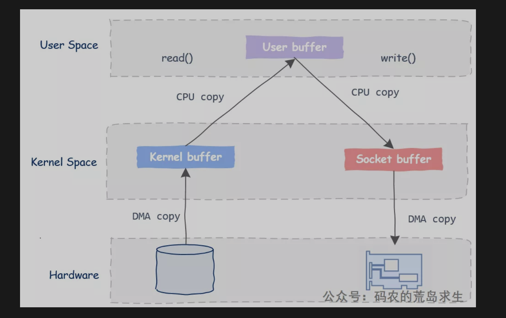
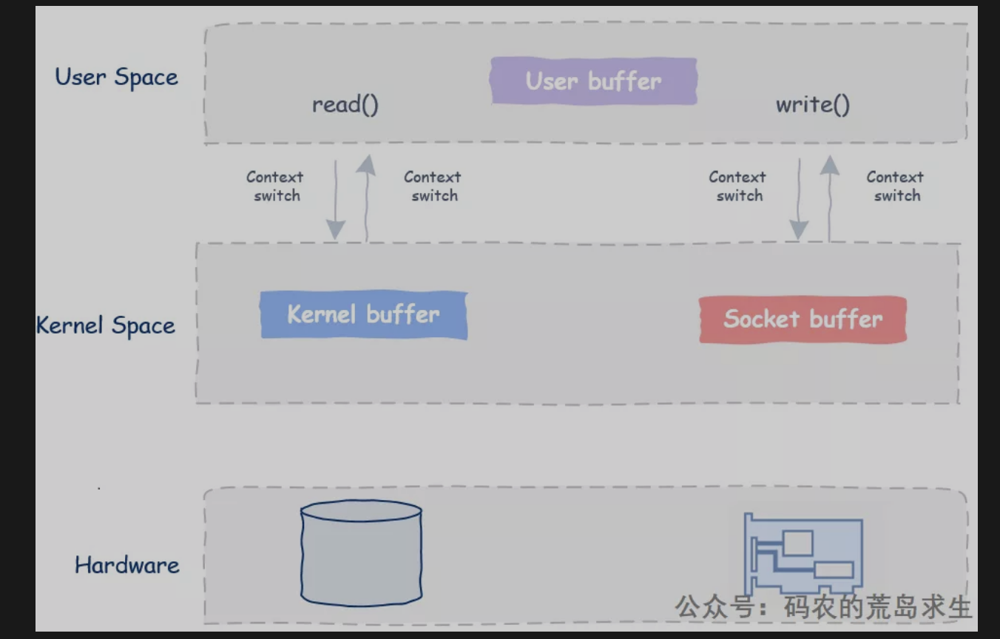
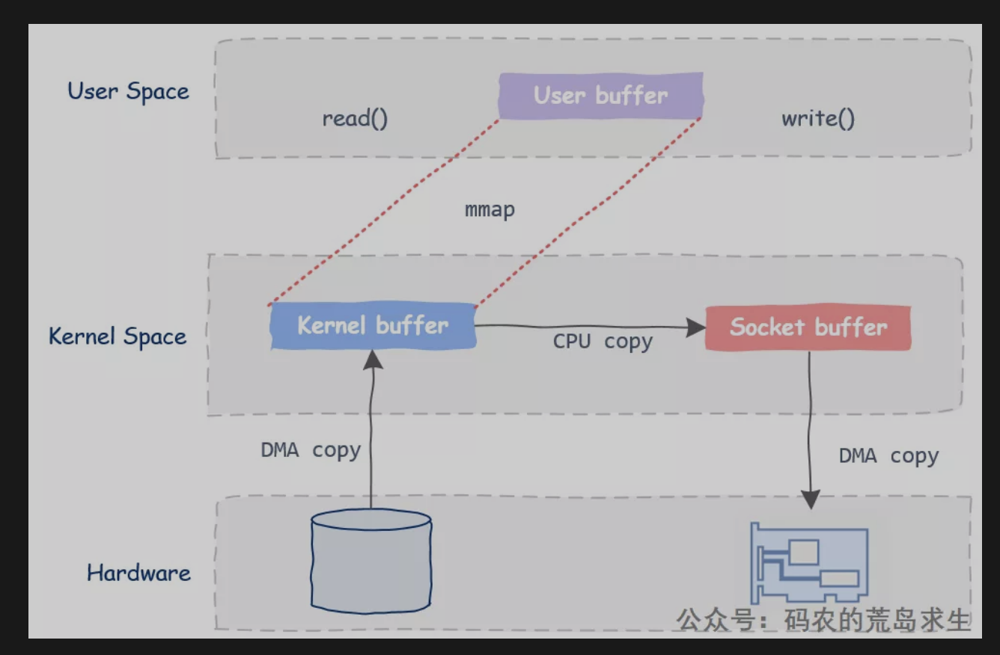
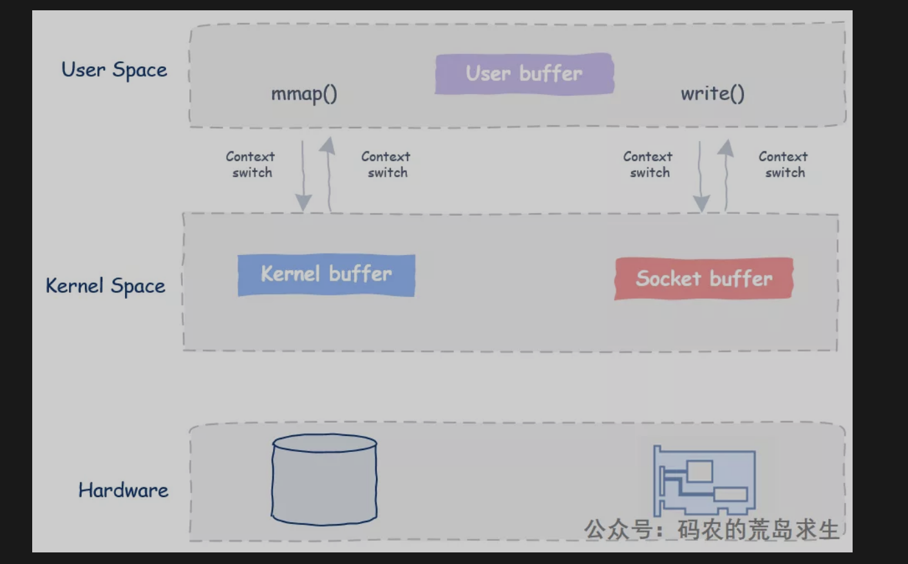
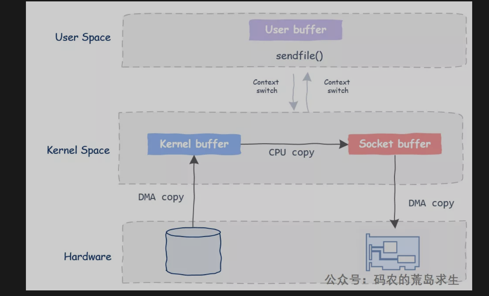
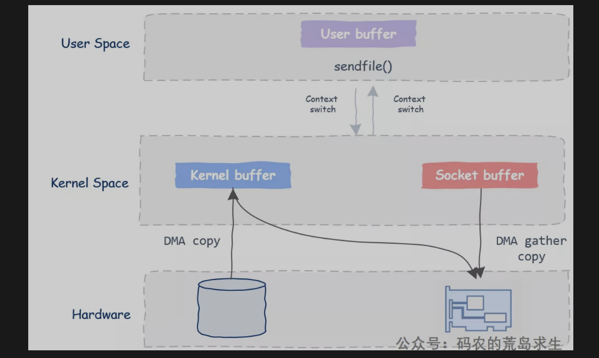
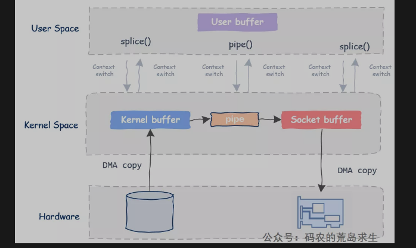

## 普通读写（read/write）--- 四次上下文切换&四次数据拷贝

浏览器打开一个网页需要很多数据，包括看到的图片、html文件、css文件、js文件等等，当浏览器请求这类文件时服务器端的工作其实是非常简单的：服务器只需要从磁盘中抓出该文件然后丢给网络发送出去。

#### 普通读写代码

````shell
read(fileDesc, buf, len);
write(socket, buf, len);
````

这两段代码非常简单，第一行代码从文件中读取数据存放在buf中，然后将buf中的数据通过网络发送出去。

注意观察buf，服务器全程没有对buf中的数据进行任何修改，buf里的数据在用户态逛了一圈后挥一挥衣袖没有带走半点云彩就回到了内核态。

这两行看似简单的代码实际上在底层发生了什么呢？

答案是这样的：

- User Space ：用户空间
- Kernel Space: 内核空间



这简单的两行代码涉及：四次数据拷贝以及四次上下文切换：




- read函数会涉及一次用户态到内核态的切换，操作系统会向磁盘发起一次IO请求，当数据准备好后通过DMA技术把数据拷贝到内核的buffer中，注意本次数据拷贝无需CPU参与。
- 此后操作系统开始把这块数据从内核拷贝到用户态的buffer中，此时read()函数返回，并从内核态切换回用户态，到这时read(fileDesc, buf, len);这行代码就返回了，buf中装好了新鲜出炉的数据。
- 接下来send函数再次导致用户态与内核态的切换，此时数据需要从用户态buf拷贝到网络协议子系统的buf中，具体点该buf属于在代码中使用的这个socket。
- 此后send函数返回，再次由内核态返回到用户态；此时在程序员看来数据已经成功发出去了，但实际上数据可能依然停留在内核中，此后第四次数据copy开始，利用DMA技术把数据从socket buf拷贝给网卡，然后真正的发送出去。

---

## mmap ---- 三次数据拷贝、四次上下文切换
#### mmap读写代码

````shell
buf = mmap(file, len);//两次上下文切换
write(socket, buf, len);//两次上下文切换
````

- mmap仅仅将**文件内容映射到了进程地址空间中**，并没有真正的拷贝到进程地址空间，这节省了一次从内核态到用户态的数据拷贝。

- 同样的，当调用write时数据直接从内核buf拷贝给了socket buf，而不是像read/write方法中把用户态数据拷贝给socket buf。



我们可以看到，**利用mmap我们节省了一次数据拷贝，上下文切换依然是四次**。



尽管mmap可以节省数据拷贝，但维护文件与地址空间的映射关系也是有代价的，除非CPU拷贝数据的时间超过维系映射关系的代价，否则基于mmap的程序性能可能不及传统的read/write。

此外，如果映射的文件被其它进程截断，在Linux系统下你的进程将立即接收到SIGBUS信号，因此这种异常情况也需要正确处理。

除了mmap之外，还有其它办法也可以实现零拷贝。

## sendfile----三次数据拷贝、两次上下文切换

在Linux系统下为了解决数据拷贝问题专门设计了这一系统调用：

````shell
#include <sys/sendfile.h>
ssize_t sendfile(int out_fd, int in_fd, off_t *offset, size_t count);
````

Windows下也有一个作用类似的API：TransmitFile。

这一系统调用的目的是在两个文件描述之间拷贝数据，但值得注意的是，数据拷贝的过程完全是在内核态完成，因此在网络服务器的这个例子中我们将把那两行代码简化为一行，也就是调用这里的sendfile。

使用sendfile将节省两次数据拷贝，因为数据无需传输到用户态：



调用sendfile后，首先DMA机制会把数据从磁盘拷贝到内核buf中，接下来把数据从内核buf拷贝到相应的socket buf中，最后利用DMA机制将数据从socket buf拷贝到网卡中。

我们可以看到，同使用传统的read/write相比少了一次数据拷贝，而且内核态和用户态的切换只有两次。

有的同学可能已经看出了，这好像不是零拷贝吧，在内核中这不是还有一次从内核态buf到socket buf的数据拷贝吗？这次拷贝看上去也是没有必要的。

的确如此，为解决这一问题，单纯的软件机制已经不够用了，我们需要硬件来帮一点忙，这就是DMA Gather Copy。

## sendfile 与 DMA Gather Copy

- 网卡利用DMA Gather Copy机制将消息头以及需要传输的数据等直接组装在一起发送出去。

- 在这一机制的加持下，CPU甚至完全不需要接触到需要传输的数据，而且程序利用sendfile编写的代码也无需任何改动，这进一步提升了程序性能。




#### 当前流行的消息中间件kafka就基于sendfile来高效传输文件。

- 实际上sendfile的使用场景是比较受限的，大前提是用户态无需看到操作的数据，并且只能从文件描述符往socket中传输数据，而且DMA Gather Copy也需要硬件支持；

- 一种不依赖硬件特性同时又能在任意两个文件描述符之间以零拷贝方式高效传递数据的方法呢？

## Splice

还是以网络服务器为例，DMA把数据从磁盘拷贝到文件buf，然后将数据写入管道，当在再次调用splice后将数据从管道读入socket buf中，然后通过DMA发送出去，值得注意的是向管道写数据以及从管道读数据并没有真正的拷贝数据，而仅仅传递的是该数据相关的必要信息。


