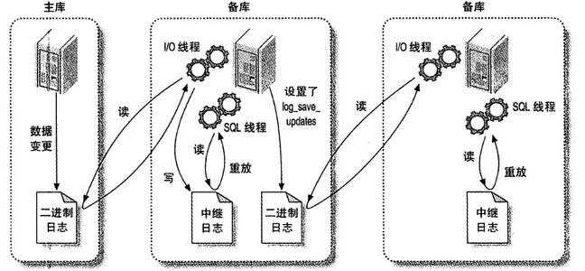

- Master将数据改变记录到二进制日志(binary log)中，也就是配置文件log-bin指定的文件，这些记录叫做二进制日志事件(binary log events)
- Slave通过I/O线程读取Master中的binary log events并写入到它的中继日志(relay log)
- Slave重做中继日志中的事件，把中继日志中的事件信息一条一条的在本地执行一次，完成数据在本地的存储，从而实现将改变反映到它自己的数据(数据重放)