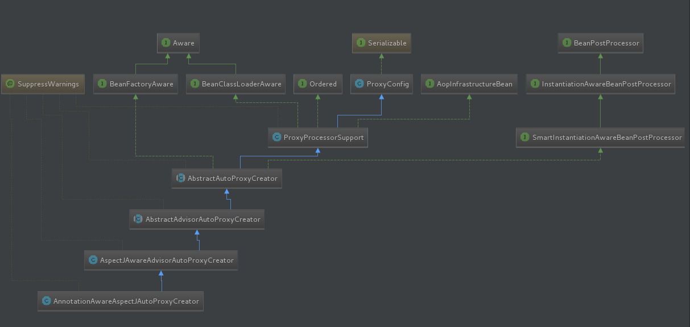

### @EnableAspectJAutoProxy 【开启基于注解的aop模式】

- 进入这个注解，它通过@Import标签向容器当中导入了一个注册器。AspectJAutoProxyRegistrar

- 其底层代码就是往容器注册了一个Bean，如果容器中不存在AUTO_PROXY_CREATOR_BEAN_NAME为这个的bean,那么就注册一个名字为这的bean.类型为AnnotationAwareAspectJAutoProxyCreator，

````java
@Target(ElementType.TYPE)
@Retention(RetentionPolicy.RUNTIME)
@Documented
@Import(AspectJAutoProxyRegistrar.class)
public @interface EnableAspectJAutoProxy {

	private static BeanDefinition registerOrEscalateApcAsRequired(Class<?> cls, BeanDefinitionRegistry registry, Object source) {
		Assert.notNull(registry, "BeanDefinitionRegistry must not be null");
		
		if (registry.containsBeanDefinition(AUTO_PROXY_CREATOR_BEAN_NAME)) {
			BeanDefinition apcDefinition = registry.getBeanDefinition(AUTO_PROXY_CREATOR_BEAN_NAME);
			if (!cls.getName().equals(apcDefinition.getBeanClassName())) {
				int currentPriority = findPriorityForClass(apcDefinition.getBeanClassName());
				int requiredPriority = findPriorityForClass(cls);
				if (currentPriority < requiredPriority) {
					apcDefinition.setBeanClassName(cls.getName());
				}
			}
			return null;
		}
		RootBeanDefinition beanDefinition = new RootBeanDefinition(cls);
		beanDefinition.setSource(source);
		beanDefinition.getPropertyValues().add("order", Ordered.HIGHEST_PRECEDENCE);
		beanDefinition.setRole(BeanDefinition.ROLE_INFRASTRUCTURE);
		registry.registerBeanDefinition(AUTO_PROXY_CREATOR_BEAN_NAME, beanDefinition);
		return beanDefinition;
	}

````

---



顶部基类实现了BeanPostProcessor接口和BeanFactoryAware，说明这个类是一个后置处理器，并且初始化的时候，会自动装配BeanFactory。（后置处理器的作用时期是，创建完成初始化前后）

### 小结：

- @EnableAspectJAutoProxy为容器中注册一个`AnnotationAwareAspectJAutoProxyCreator`后置处理器的定义信息。下面分析他是如何被创建的。

----

### AnnotationAwareAspectJAutoProxyCreator的创建过程。

- 上面说到，注解@EnableAspectJAutoProxy为容器中导入了该类的注册信息，这仅仅是个注册信息，相当于在容器中添加了一个标识，但是实际上真正还没被实例化。

- 初始化容器的过程中会创建后置处理器。具体调用时机在refresh()中的 registerBeanPostProcessors(beanFactory)方法

````java
	@Override
	public void refresh() throws BeansException, IllegalStateException {
		synchronized (this.startupShutdownMonitor) {
			prepareRefresh();
			ConfigurableListableBeanFactory beanFactory = obtainFreshBeanFactory();
			prepareBeanFactory(beanFactory);
			try {
				postProcessBeanFactory(beanFactory);
				invokeBeanFactoryPostProcessors(beanFactory);
				
				// 注册后置处理器
				registerBeanPostProcessors(beanFactory);
				
				initMessageSource();
				initApplicationEventMulticaster();.
				onRefresh();
				registerListeners();
				finishBeanFactoryInitialization(beanFactory);
				finishRefresh();
			}
````

#### registerBeanPostProcessors(beanFactory)的代码如下：

````java
public static void registerBeanPostProcessors(ConfigurableListableBeanFactory beanFactory, AbstractApplicationContext applicationContext) {
	        //获得容器中已经定义好了 需要被创建的所有的	BeanPostProcessor(后置处理器)
		String[] postProcessorNames = beanFactory.getBeanNamesForType(BeanPostProcessor.class, true, false);
	        //额外添加一个后置处理器
		int beanProcessorTargetCount = beanFactory.getBeanPostProcessorCount() + 1 + postProcessorNames.length;
		beanFactory.addBeanPostProcessor(new BeanPostProcessorChecker(beanFactory, beanProcessorTargetCount));

		//对后置处理器进行分离  分为：1、实现了priorityOrdered接口 2、实现了Ordered接口 3、原生的在分离过程中还将MergedBeanDefinitionPostProcessor类型的分开来
		List<BeanPostProcessor> priorityOrderedPostProcessors = new ArrayList<BeanPostProcessor>();
		List<BeanPostProcessor> internalPostProcessors = new ArrayList<BeanPostProcessor>();
		List<String> orderedPostProcessorNames = new ArrayList<String>();
		List<String> nonOrderedPostProcessorNames = new ArrayList<String>();
		//分离实现了PriorityOrdered接口的后置处理器
		for (String ppName : postProcessorNames) {
			if (beanFactory.isTypeMatch(ppName, PriorityOrdered.class)) {
				//先尝试获取
				BeanPostProcessor pp = beanFactory.getBean(ppName, BeanPostProcessor.class);
				priorityOrderedPostProcessors.add(pp);
				if (pp instanceof MergedBeanDefinitionPostProcessor) {
					internalPostProcessors.add(pp);
				}
			}
			else if (beanFactory.isTypeMatch(ppName, Ordered.class)) {
				orderedPostProcessorNames.add(ppName);
			}
			else {
				nonOrderedPostProcessorNames.add(ppName);
			}
		}
		// First, register the BeanPostProcessors that implement PriorityOrdered.
		sortPostProcessors(priorityOrderedPostProcessors, beanFactory);
		registerBeanPostProcessors(beanFactory, priorityOrderedPostProcessors);

		// 分离实现了Order接口的
		List<BeanPostProcessor> orderedPostProcessors = new ArrayList<BeanPostProcessor>();
		for (String ppName : orderedPostProcessorNames) {
			BeanPostProcessor pp = beanFactory.getBean(ppName, BeanPostProcessor.class);
			orderedPostProcessors.add(pp);
			if (pp instanceof MergedBeanDefinitionPostProcessor) {
				internalPostProcessors.add(pp);
			}
		}
		sortPostProcessors(orderedPostProcessors, beanFactory);
		registerBeanPostProcessors(beanFactory, orderedPostProcessors);

		//没有实现排序接口的BeanPostProcessor
		List<BeanPostProcessor> nonOrderedPostProcessors = new ArrayList<BeanPostProcessor>();
		for (String ppName : nonOrderedPostProcessorNames) {
			// 是先尝试获取 如果缓中没有 那么将执行创建的过程
			BeanPostProcessor pp = beanFactory.getBean(ppName, BeanPostProcessor.class);
			nonOrderedPostProcessors.add(pp);
			if (pp instanceof MergedBeanDefinitionPostProcessor) {
				internalPostProcessors.add(pp);
			}
			
		}
		//后置处理器的信息添加到工厂
		registerBeanPostProcessors(beanFactory, nonOrderedPostProcessors);
		sortPostProcessors(internalPostProcessors, beanFactory);
		
		//后置处理器的信息添加到工厂
		registerBeanPostProcessors(beanFactory, internalPostProcessors);
		beanFactory.addBeanPostProcessor(new ApplicationListenerDetector(applicationContext));
	}


````

#### beanFactory.getBean()方法如下,

- 调用的是AbstarctBeanFactory这个类的getBean()方法。调用过程是 getBean-->doGetBean-->getSingleton-->getObject-->CreatBean-->doCreatBean

````java
	@Override
	public <T> T getBean(String name, Class<T> requiredType) throws BeansException {
		//调用doGetBean
		return doGetBean(name, requiredType, null, false);
	}


         //doGetBean方法如下
		protected <T> T doGetBean(
			final String name, final Class<T> requiredType, final Object[] args, boolean typeCheckOnly)
			throws BeansException {
						//省略部分代码

			try {
				final RootBeanDefinition mbd = getMergedLocalBeanDefinition(beanName);
				checkMergedBeanDefinition(mbd, beanName, args);

				// 如果要创建的bean的bean有其他依赖
				String[] dependsOn = mbd.getDependsOn();
				if (dependsOn != null) {
					for (String dep : dependsOn) {
						if (isDependent(beanName, dep)) {
							throw new BeanCreationException(mbd.getResourceDescription(), beanName,
									"Circular depends-on relationship between '" + beanName + "' and '" + dep + "'");
						}
						registerDependentBean(dep, beanName);
						//先尝试获取依赖的bean
						getBean(dep);
					}
				}

				// 如果是单实例bean
				if (mbd.isSingleton()) {
					//先从缓存中获取是否之前创建过该单实例bean
					sharedInstance = getSingleton(beanName, new ObjectFactory<Object>() {
						@Override
						public Object getObject() throws BeansException {
							try {
								//执行creatBean
								return createBean(beanName, mbd, args);
							}
							catch (BeansException ex) {
								destroySingleton(beanName);
								throw ex;
							}
						}
					});
					bean = getObjectForBeanInstance(sharedInstance, name, beanName, mbd);
				}

				else if (mbd.isPrototype()) {
					//多例的bean的处理逻辑
				}


````

#### createBean（）方法 

- 此方法是调用AbstractAutowireCapableBeanFactory这个类的

````java
	@Override
	protected Object createBean(String beanName, RootBeanDefinition mbd, Object[] args) throws BeanCreationException {
			// 部分代码省略
		try {
			// AOP 实现： 先尝试返回一个动态代理对象
			Object bean = resolveBeforeInstantiation(beanName, mbdToUse);
			if (bean != null) {
			   // 如果创建成功，则返回代理对象
				return bean;
			}
		}
		//执行创建bean的操作
		Object beanInstance = doCreateBean(beanName, mbdToUse, args);
		return beanInstance;
	}


````

#### doCreateBean（）方法 

````java
	protected Object doCreateBean(final String beanName, final RootBeanDefinition mbd, final Object[] args)
			throws BeanCreationException {

		// 部分代码省略....
		
		if (instanceWrapper == null) {
			//实例化一个bean  但是此时对象内属性值都是默认值
			instanceWrapper = createBeanInstance(beanName, mbd, args);
		}
		
		// 部分代码省略....

		try {
			// 给bean的各种属性赋值
			populateBean(beanName, mbd, instanceWrapper);
			if (exposedObject != null) {
			//初始化bean 调动bean的初始化方法
				exposedObject = initializeBean(beanName, exposedObject, mbd);
			}
			
		}
	

````

#### initializeBean(beanName, exposedObject, mbd)初始化方法;这也验证了后置处理器是在创建完成 初始化前后起作用的

````java
protected Object initializeBean(final String beanName, final Object bean, RootBeanDefinition mbd) {
			// 部分代码省略....
			
			//处理Aware接口的方法回调
			invokeAwareMethods(beanName, bean);
		
		Object wrappedBean = bean;
		if (mbd == null || !mbd.isSynthetic()) {
			//遍历所有后置处理器 调用后置处理器的postProcessBeforeInitialization方法
			wrappedBean = applyBeanPostProcessorsBeforeInitialization(wrappedBean, beanName);
		}

		try {
			//执行自定义初始化方法如自定义的：init方法
			invokeInitMethods(beanName, wrappedBean, mbd);
		}

		if (mbd == null || !mbd.isSynthetic()) {
			//遍历所欲后置处理器 调用postProcessAfterInitialization
			wrappedBean = applyBeanPostProcessorsAfterInitialization(wrappedBean, beanName);
		}
		return wrappedBean;
	}

````
---------------

## 小结一下：AnnotationAwareAspectJAutoProxyCreator的创建过程：

- 因为@EnableAspectJAutoProxy为容器添加了一个该bean的定义信息在容器中

````
1、传入配置类，创建ioc容器
2、注册配置类，调用refresh（）刷新容器；
3、`registerBeanPostProcessors(beanFactory)`注册后置处理器
****1）、获取容器中已经定义好的所有后置处理器（`AnnotationAwareAspectJAutoProxyCreator`就在其中）
**** 2）、对BeanPostProcessor进行分类：分为1、实现了priorityOrdered接口     2、实现了Ordered接口   3、原生的
****3）、优先注册实现了PriorityOrdered接口的BeanPostProcessor；
****4）、再给容器中注册实现了Ordered接口的BeanPostProcessor；
****5）、注册没实现优先级接口的BeanPostProcessor；
****6）、创建BeanPostProcessor 执行的getBean()方法->doGetBean----->getSingleton---->getObject----->CreatBean---->doCreatBean
**************1）、先创建该实例（createBeanInstance(beanName, mbd, args)）
**************2）、populateBean；给bean的各种属性赋值
**************3）、initializeBean：初始化bean；
***********************1)、invokeAwareMethods()：处理Aware接口的方法回调.(此处回调了AnnotationAwareAspectJAutoProxyCreator的setBeanFactory方法)
***********************2)、后置处理器的postProcessBeforeInitialization（
***********************3)、invokeInitMethods()；执行自定义的初始化方法
***********************4)、执行后置处理器的postProcessAfterInitialization（）；
**************4）、把所有创建的BeanPorcess注册到BeanFactory中beanFactory.addBeanPostProcessor(postProcessor)

````

原文链接：https://blog.csdn.net/weixin_43732955/article/details/98994353