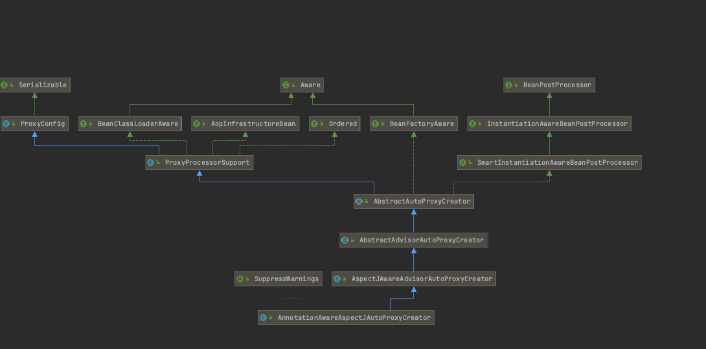

### 1、AnnotationAwareAspectJAutoProxyCreator 继承关系图。



- 他的父类实现了`InstantiationAwareBeanPostProcessor`、而该接口继承了后置处理器BeanPostProcessor接口，他的父类有这么几个实现方法

````java
	//bean实例化前的回调操作
     @Override
	public Object postProcessBeforeInstantiation(Class<?> beanClass, String beanName) throws BeansException {
	}
		//bean实例化后的回调操作
	@Override
	public boolean postProcessAfterInstantiation(Object bean, String beanName) {
	}


		//bean实例化完成后初始化之前回调操作
	@Override
	public Object postProcessBeforeInitialization(Object bean, String beanName) {
	}
		
		//bean实例化完成初始化之后回调操作
	@Override
	public Object postProcessAfterInitialization(Object bean, String beanName) throws BeansException {
	
	}


````
 也就是说该类会在bean的实例化和初始化的前后起作用 
  
- BeanPostProcessor是在Bean对象创建完成初始化前后调用的
 
- InstantiationAwareBeanPostProcessor是在创建Bean实例之前先尝试用后置处理器返回对象的

---------

### 那么接着介绍上述的方法是在bean创建的过程怎么起作用的

- 容器在启动过程中，会有一个方法**finishBeanFactoryInitialization(beanFactory)** 这个是初始化容器中剩余的单实例bean
- getBean()方法->doGetBean----->getSingleton(尝试从缓存中获取)---->getObject----->CreatBean

- 在CreatBean方法中有一个方法、resolveBeforeInstantiation(beanName, mbdToUse);解析BeforeInstantiation会先尝试返回一个代理对象，如果返回不成功，那么就执行doCreatBea方法。

````java
protected Object createBean(String beanName, RootBeanDefinition mbd, Object[] args) throws BeanCreationException {

   	try {
   		// 先尝试返回一个代理对象
   		Object bean = resolveBeforeInstantiation(beanName, mbdToUse);
   		if (bean != null) {
   			return bean;
   		}
   	}
   	catch (Throwable ex) {
   		throw new BeanCreationException(mbdToUse.getResourceDescription(), beanName,
   				"BeanPostProcessor before instantiation of bean failed", ex);
   	}
   	//如果没有返回 那么就执行doCreateBean操作。
   	Object beanInstance = doCreateBean(beanName, mbdToUse, args);
   	
   }

````
- 我们要重点关注一下resolveBeforeInstantiation这个方法，每次bean创建之前都会执行该方法，会先尝试返回一个代理对象。

````java
	protected Object resolveBeforeInstantiation(String beanName, RootBeanDefinition mbd) {
   	Object bean = null;
   	if (!Boolean.FALSE.equals(mbd.beforeInstantiationResolved)) {
   		// Make sure bean class is actually resolved at this point.
   		if (!mbd.isSynthetic() && hasInstantiationAwareBeanPostProcessors()) {
   			Class<?> targetType = determineTargetType(beanName, mbd);
   			if (targetType != null) {
   			//拿到所有的后置处理器 ，进行遍历如果是【InstantiationAwareBeanPostProcessor】类型那么就执行postProcessBeforeInstantiation
   			//如果得到返回结果就直接返回
   				bean = applyBeanPostProcessorsBeforeInstantiation(targetType, beanName);
   				if (bean != null) {
   					//如果返回的不为空 又接着调用该类的postProcessAfterInitialization方法
   					bean = applyBeanPostProcessorsAfterInitialization(bean, beanName);
   				}
   			}
   		}
   		mbd.beforeInstantiationResolved = (bean != null);
   	}
   	return bean;
   }


//#######################################applyBeanPostProcessorsBeforeInstantiation方法#########################################
   protected Object applyBeanPostProcessorsBeforeInstantiation(Class<?> beanClass, String beanName) {
   //获得容器中所有的后置处理器
   	for (BeanPostProcessor bp : getBeanPostProcessors()) {
   	    //如果是【InstantiationAwareBeanPostProcessor】类型 ，执行该类的postProcessBeforeInstantiation方法，也就是上面提醒大家关注的方法，叫bean实例化之前的回调方法
   		if (bp instanceof InstantiationAwareBeanPostProcessor) {
   			InstantiationAwareBeanPostProcessor ibp = (InstantiationAwareBeanPostProcessor) bp;
   			Object result = ibp.postProcessBeforeInstantiation(beanClass, beanName);
   			if (result != null) {
   				return result;
   			}
   		}
   	}

````
## 小结：

````
1、 当我们在创建bean的时候都会调用一个resolveBeforeInstantiation 尝试返回单实例bean
   		bean = applyBeanPostProcessorsBeforeInstantiation（）：
   						拿到所有后置处理器，如果是InstantiationAwareBeanPostProcessor类型
							就执行postProcessBeforeInstantiation
   						if (bean != null) {
   							bean = applyBeanPostProcessorsAfterInitialization(bean, beanName);
   						}
2、如果尝试返回一个代理对象为null 那么就执行doCreateBean()操作	
1）、先创建该实例（createBeanInstance(beanName, mbd, args)）
2）、populateBean；给bean的各种属性赋值
3）、initializeBean：初始化bean；
   	1)、invokeAwareMethods()：处理Aware接口的方法回调.(此处回调了AnnotationAwareAspectJAutoProxyCreator的setBeanFactory方法)
   	2)、后置处理器的postProcessBeforeInitialization（）
   	3)、invokeInitMethods()；执行自定义的初始化方法
   	4)、执行后置处理器的postProcessAfterInitialization（）；

````