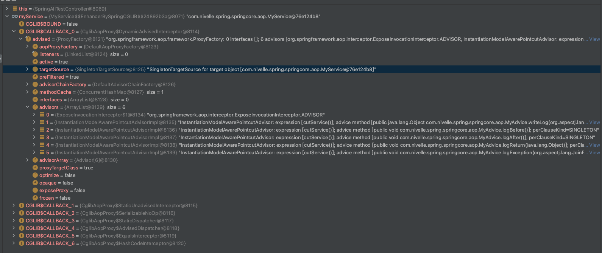
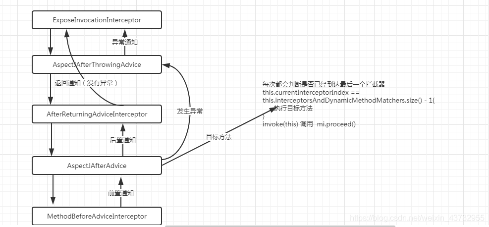
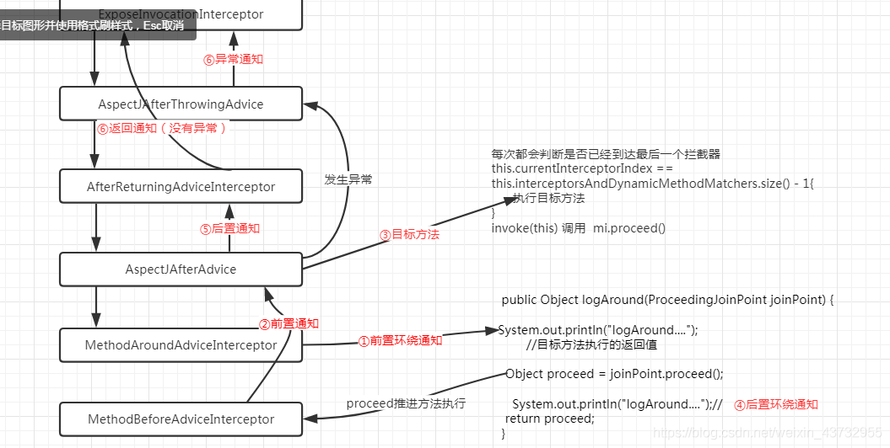

## 目标方法执行



````java
	    @Override
		public Object intercept(Object proxy, Method method, Object[] args, MethodProxy methodProxy) throws Throwable {
			     // --------------------部分代码省略-------------------
				target = getTarget();
				if (target != null) {
				//获取目标对象 #1
					targetClass = target.getClass();
				}
				//尝试返回一个拦截器链 #2
				List<Object> chain = this.advised.getInterceptorsAndDynamicInterceptionAdvice(method, targetClass);
				Object retVal;
				// 如果没有返回拦截器链 那么直接执行目标方法 #3
				if (chain.isEmpty() && Modifier.isPublic(method.getModifiers())) {
				.adaptArgumentsIfNecessary(method, args);
					retVal = methodProxy.invoke(target, argsToUse);
				}else {
					// 如果有拦截器链那么获取一个CglibMethodInvocation对象 #4 推动拦截器 // Object retVal =  mi.proceed(); #5
					retVal = new CglibMethodInvocation(proxy, target, method, args, targetClass, chain, methodProxy).proceed();
				}
				
				retVal = processReturnType(proxy, target, method, retVal);
				return retVal;
			}
			finally {
				if (target != null) {
					releaseTarget(target);
				}
				if (setProxyContext) {
					// Restore old proxy.
					AopContext.setCurrentProxy(oldProxy);
				}
			}
		}

````

- 获取目标对象 
- 尝试返回一个拦截器链 
- 如果没有返回拦截器链 那么直接执行目标方法 
- 如果有拦截器链那么获取一个CglibMethodInvocation对象 
- Object retVal = mi.proceed(); 推动拦截器 

### 尝试返回一个拦截器链 getInterceptorsAndDynamicInterceptionAdvice

`````java
	public List<Object> getInterceptorsAndDynamicInterceptionAdvice(Method method, Class<?> targetClass) {
		// 尝试从缓存中获取
		MethodCacheKey cacheKey = new MethodCacheKey(method);
		List<Object> cached = this.methodCache.get(cacheKey);
		if (cached == null) {
		   // 从工厂拿到拦截器链  具体在下面
			cached = this.advisorChainFactory.getInterceptorsAndDynamicInterceptionAdvice(this, method, targetClass);
			this.methodCache.put(cacheKey, cached);
		}
		return cached;
	}
	
`````

#### DefaultAdvisorChainFactory.getInterceptorsAndDynamicInterceptionAdvice方法

````java
	@Override
	public List<Object> getInterceptorsAndDynamicInterceptionAdvice(Advised config, Method method, Class<?> targetClass) {
		//创建一个增强器链条的list集合 在后面会不断向里面增加拦截器
		List<Object> interceptorList = new ArrayList<Object>(config.getAdvisors().length);
		Class<?> actualClass = (targetClass != null ? targetClass : method.getDeclaringClass());
		boolean hasIntroductions = hasMatchingIntroductions(config, actualClass);
		AdvisorAdapterRegistry registry = GlobalAdvisorAdapterRegistry.getInstance();
		for (Advisor advisor : config.getAdvisors()) {
			if (advisor instanceof PointcutAdvisor) {
				// 判断增强器的类型 遍历 将增强器包装成MethodInterceptor 
				PointcutAdvisor pointcutAdvisor = (PointcutAdvisor) advisor;
				if (config.isPreFiltered() || pointcutAdvisor.getPointcut().getClassFilter().matches(actualClass)) {
					MethodInterceptor[] interceptors = registry.getInterceptors(advisor);
					MethodMatcher mm = pointcutAdvisor.getPointcut().getMethodMatcher();
					if (MethodMatchers.matches(mm, method, actualClass, hasIntroductions)) {
						if (mm.isRuntime()) {
							// Creating a new object instance in the getInterceptors() method
							// isn't a problem as we normally cache created chains.
							for (MethodInterceptor interceptor : interceptors) {
								interceptorList.add(new InterceptorAndDynamicMethodMatcher(interceptor, mm));
							}
						}
						else {
							interceptorList.addAll(Arrays.asList(interceptors));
						}
					}
				}
			}
				// 判断增强器的类型 遍历 将增强器包装成MethodInterceptor 
			else if (advisor instanceof IntroductionAdvisor) {
				IntroductionAdvisor ia = (IntroductionAdvisor) advisor;
				if (config.isPreFiltered() || ia.getClassFilter().matches(actualClass)) {
					Interceptor[] interceptors = registry.getInterceptors(advisor);
					interceptorList.addAll(Arrays.asList(interceptors));
				}
			}
				// 判断增强器的类型 遍历 将增强器包装成MethodInterceptor 
			else {
				Interceptor[] interceptors = registry.getInterceptors(advisor);
				interceptorList.addAll(Arrays.asList(interceptors));
			}
		}

		return interceptorList;
	}

`````

- 这个方法的主要作用就是 将所有增强器方法中需转换的 转换成为`MethodInterceptor`类型，也就是拦截器链。然后如果有拦截器链，就会执行#4方法

#### 如果有拦截器链，则执行 该步骤-》new CglibMethodInvocation().process()方法执行器的调用

- 拦截器链该是如何进行调用的。我们说的拦截器链条，就是我们定义的那些通知方法比如:前置通知，后置通知，返回通知 异常通知

````java
	@Override
	public Object proceed() throws Throwable {
		//	currentInterceptorIndex 的默认初始值为-1
		//这个条件会有两种情况成立：
		//1、拦截器链条的长度为0
		//2、或者执行到最后一个拦截器器(也就是最后一个通知方法)
		if (this.currentInterceptorIndex == this.interceptorsAndDynamicMethodMatchers.size() - 1) {
			//类似于我们手动推进执行目标方法，目标方法的调用
			return invokeJoinpoint();
		}
		// 当执行一个拦截器之前会currentInterceptorIndex 加一
		Object interceptorOrInterceptionAdvice = this.interceptorsAndDynamicMethodMatchers.get(++this.currentInterceptorIndex);
		if (interceptorOrInterceptionAdvice instanceof InterceptorAndDynamicMethodMatcher) {
			InterceptorAndDynamicMethodMatcher dm =(InterceptorAndDynamicMethodMatcher) interceptorOrInterceptionAdvice;
			if (dm.methodMatcher.matches(this.method, this.targetClass, this.arguments)) {
				return dm.interceptor.invoke(this);
			}
			else {
				return proceed();
			}
		}
		else {
			// 调用拦截器的invoke方法
			return ((MethodInterceptor) interceptorOrInterceptionAdvice).invoke(this);
		}
	}

	// 目标方法
	protected Object invokeJoinpoint() throws Throwable {
		return AopUtils.invokeJoinpointUsingReflection(this.target, this.method, this.arguments);
	}

````

#### 第一个拦截器是ExposeInvocationInterceptor，进入他的invoke方法(这是它内部自带的一个通知方法)，下面代码有一个重要的一句话mi.proceed(),他也执行了mi.proceed方法

````java
	@Override
	public Object invoke(MethodInvocation mi) throws Throwable {
		MethodInvocation oldInvocation = invocation.get();
		invocation.set(mi);
		try {
			return mi.proceed();
		}
		finally {
			invocation.set(oldInvocation);
		}
	}

````
- mi.proceed()方法，也就回到我们一开始调用的proceed()方法体中，重复又执行一遍逻辑，只不过获取到的是另外一个拦截器

````java
	@Override
	public Object proceed() throws Throwable {
		//判断 是否到达最后一个
		if (this.currentInterceptorIndex == this.interceptorsAndDynamicMethodMatchers.size() - 1) {
			return invokeJoinpoint();
		}
		//获得 角标为1的拦截器
		Object interceptorOrInterceptionAdvice = this.interceptorsAndDynamicMethodMatchers.get(++this.currentInterceptorIndex);
		// 调用拦截器的invoke(this);方法
			return ((MethodInterceptor) interceptorOrInterceptionAdvice).invoke(this);
		}
	}

````

#### 第二个拦截器是AspectJAfterThrowingAdvice，同样进入他的invoke方法，代码如下：

````java
	@Override
	public Object invoke(MethodInvocation mi) throws Throwable {
		try {
			return mi.proceed();
		}
		catch (Throwable ex) {
			if (shouldInvokeOnThrowing(ex)) {
				invokeAdviceMethod(getJoinPointMatch(), null, ex);
			}
			throw ex;
		}
	}

````

- 如出一辙它也是调用MethodInvocation 的proceed()方法，也就有由进入下面这段代码

````java
@Override
	public Object proceed() throws Throwable {
		//判断 是否到达最后一个
		if (this.currentInterceptorIndex == this.interceptorsAndDynamicMethodMatchers.size() - 1) {
			return invokeJoinpoint();
		}
		//获得 角标为2的拦截器
		Object interceptorOrInterceptionAdvice =
				this.interceptorsAndDynamicMethodMatchers.get(++this.currentInterceptorIndex);
		// 调用拦截器的invoke(this);方法
			return ((MethodInterceptor) interceptorOrInterceptionAdvice).invoke(this);
		}
	}

````

##### 第三个AspectJAfterReturningAdvice返回通知，同样它由调用返回通知的invoke(this)方法，就这样形成了一个链条
  
````java
	@Override
	public Object invoke(MethodInvocation mi) throws Throwable {
		//调用前置通知方法
		this.advice.before(mi.getMethod(), mi.getArguments(), mi.getThis() );###1
		//同样也是调用MethodInvocation 对象的mi.proceed()
		return mi.proceed();###2
	}


````
#### 第四个拦截器 MethodBeforeAdviceInterceptor 的方法代码



----


### 环绕通知

