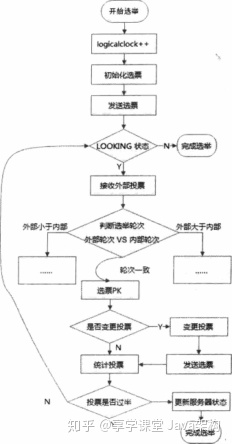

###概念：

- Zookeeper的服务器三种角色：`Leader`，`Follower`，`Observer`。Leader提供读和写，Follower提供读，参与过半投票，Observer只提供读，不参与投票，可以提高读性能。
- ZXID：事务ID，用来唯一标识一次服务器状态的变更
- myid:服务器SID，一个数字,通过配置文件配置，唯一

### 选举有两种情况，一是服务器启动的投票，二是运行期间的投票。

## 选举过程概述
经过前面的zookeeper相关的文章，我们也对zookeeper有一定的了解，知道在zookeeper中存在三种服务器角色，分别是Leader，Follower以及Observer，其中Observer仅仅作为一个监控协调者的作用，并不参与zookeeper对外提供服务以及zookeeper的选举，而zookeeper的选举我们从前面的内容也知道，总共可以分为两种，第一种是当整个zookeeper的集群启动后，进行的选举过程，第二种则是在zookeeper运行期间，当出现Leader崩溃的过程时，zookeeper进行的选举操作。接下来我们先从启动的时候触发的选举开始学习

### 服务端启动时选举过程
我们在搭建zookeeper的时候往往会有一个配置文件，里面存放一个myid，用来标示集群内不同客户端的机器编号，当至少两台含有myid的机器启动后，就开始进入了zookeeper的集群选举流程

#### 每个server发起一个投票

由于当前是刚启动状态，因此每一个服务实例都会默认把自己作为Leader服务器来发起投票，而每一个投票中包含了最基本的选举所需要的元素，例如myid和ZXID，我们将这两个按照选票的方式表示，例如myid为1，ZXID为0，我们将会表示为(1,0)，由于每台服务端实例优先都是按照自己是Leader发起投票，那么server1默认生成的选票就是(1,0),server2的选票则是(2,0)，以此类推

#### 接受到其他服务端实例发来的选票

每台服务端实例都会收到其他服务端实例发来的选票信息，当收到选票后，就会开始校验处理选票的流程

#### 校验处理选票

其他服务实例发来的选票，要经过一系列验证，比如是不是本轮投票的选票，是否来自于Looking状态的实例发来的选票，经过校验后，就会和当前实例的选票信息进行pk比较，比较的规则大致如下:

- ①优先比较ZXID,ZXID不一样的时候，较大的那个选票所在的服务实例作为Leader

- ②如果两个选票的ZXID相同的话，那么就会比较myid，默认为myid较大的服务实例作为Leader

根据这个规则，我们来看看当server1收到server2的选票后，比较的流程是怎样的，首先两个选票都是第一轮投票选举，所以zxid都是0，接着就要开始比较myid了，server1的myid是1，而server2的myid是2，大于自身的myid，那么server2就应该是Leader，因此server1会更新自己的选票为(2,0)，然后下次发送的时候就是发送新的选票信息出去

#### 统计每一次选票

每一次投票以后，都会统计所有的投票，判断是否有过半的实例接受到了相同的选票信息，对与当前server1和server2来说，必须这两个实例的选票都一样才可以算是完成了选举流程，而如果是单数的实例的话，只需要达到(实例数 + 1) / 2的服务端实例接受到一样的选票即可。而经过上面的流程以后，只要server1比较完选票，也发出了(2,0)的选票信息，即可完成选举

#### 同步服务端实例状态

一旦选举完成，选出了Leader实例，每个服务实例都会更新自身的状态，如果是Follower，就会变为FOLLOWER，如果是Leader则会变成LEADING状态。

---

### 服务端运行期间进行的选举

除了启动zookeeper集群的时候，一般情况下Leader会一直作为集群中的Leader，即使集群中的Follower挂了或者是新机器实例加入集群中，也不会影响Leader。但是一旦Leader无法响应或者是宕机了，Zookeeper集群将无法对外进行服务，而是进行新一轮的Leader选举，而这个选举的过程与初始化启动集群的选举过程大体上是差不多的，但是有区别的是这个时候每个机器将要从自身的运行状态切换到选举状态

#### 更新自身状态

当Leader实例挂了以后，剩下的所有Follower实例都会将自身的服务状态变更为LOOKING，然后进行Leader选举流程

#### 一样的选举流程

Leader选举的大体流程都是一样的，这里将不再赘述，当完成选举以后，每个服务端实例按照自身的角色，将自身的状态修改为对应的角色状态，这个时候选举完成，Zookeeper集群恢复对外提供服务。

### Zookeeper的选举算法

zookeeper的选举的大概流程我们知道了，但是我们都知道，选举的过程是基于算法的，zookeeper的选举算法有哪些呢？在zookeeper中，提供了三种Leader选举的算法

- 分别是LeaderElection、
  
- UDP版本的FastLeaderElection
  
- TCP版本的FastLeaderElection三种选举算法。
  
而选举算法，则是可以在`zoo.cfg配置文件`中的electionAlg属性来指定，这三种选举算法分别对应值为0-3，其中0为LeaderElection算法，使用的是UDP协议实现，1代表UDP版本的FastLeaderElection算法，这种算法是非授权模式，2代表的也是UDP版本的FastLeaderElection算法，不过这种使用的是授权模式，3代表是TCP协议实现的FastLeaderElection算法。

不过需要注意的是，从Zookeeper3.4.X版本开始，Zookeeper官方已经废弃了UDP协议实现的0-2这三种Leader选举算法，仅仅保留了3这一种TCP协议实现的FastLeaderElection算法，这也是为什么上面我们介绍选举的大致流程中不针对每一种选举算法进行分析的原因。

## Leader选举的细节
学习了选举的大概流程以后，我们发现整体流程和算法的设计不难，但是具体如何处理常见的问题的？这个时候我们需要深入细节来学习，首先Zookeeper为了处理不同情况，设计了多个服务端的状态，这个状态的定义在org .apache . zookeeper . server.quorum .QuorumPeer. ServerState 类中，分别如下:

- ①LOOKING：寻找Leader服务的状态，处于当前状态后，将会进行Leader选举流程

- ②FOLLOWING：代表当前服务端处于跟随者状态，表明是Follower服务

- ③LEADING：代表当前服务端处于领导者状态，表明是Leader服务

- ④OBSERVING：观察者状态，表明是Observer服务

前面我们也提到过，每次发出选票后，选票中包含了基本的元素，即ZXID和myid，而这个选票的定义在 apache.zookeeper.server.quorum.Vote类，代码如下:

````shell
<pre style="margin: 0px; padding: 8px 0px 6px; box-sizing: border-box; background: rgb(241, 239, 238); border-radius: 0px; overflow-y: auto; font-size: 10px; line-height: 12px; font-family: consolas, menlo, courier, monospace, "Microsoft Yahei" !important; border-width: 1px !important; border-style: solid !important; border-color: rgb(226, 226, 226) !important;">

finalprivateint version;
finalprivatelong id;
finalprivatelong zxid;
finalprivatelong electionEpoch;
finalprivatelong peerEpoch;
</pre>
````
#### 我们把常见的几个属性进行说明，如下:

属性说明

- id被选举的SID
  
- zxid当前Leader的事物ID
  
- electionEpoch逻辑时钟，解析出来的，当前处于第几轮选举投票，每次进入新一轮投票后，都会加1
  
- peerEpoch当前被选举的Leader的epochstate 当前服务所处于的状态

## 选举的通信，

CilentCnxn是Zookeeper客户端中用于处理I/O网络通信的管理器，而对应的Zookeeper的server中也有一个类 **--QuorumCnxManager类**来接受和处理Leader选举中的通信，而整个过程可以划分几个部分，大致如下:

### 消息队列处理消息

- 在QuorumCnxManager类中维护了很多队列，用于保存接受到的、等待发送的消息，还定义了消息发送器等，除了接受队列以外，其他的队列都是按照SID分组的集合。其中常见的队列和属性定义如下:

- **recvQueue**：消息接受队列，用于存放接受来的所有的消息
- **queueSendMap**：消息待发送队列，用于保存等待发送的消息集合，定义为一个Map，按照SID分组设置为key，并且每一个SID对应的都维护了一个队列，保证收发消息互不影响
- **senderWorkMap**：发送器集合，每一个senderWork发送器都对应一个远程连接的zookeeper，负责发送消息，__在senderWorkMap内部，也是按照SID分组进行维护的__。
- **lastedMessageSent**：最近发送的消息，在这个集合中，会为每一个SID维护一个最新发送的消息

### 建立连接

- 为了能彼此之间通信，zookeeper集群中的实例需要**两两建立连接**,QuorumCnxManager类在启动的时候会创建一个ServerSocket来监听Leader选举的通信端口，在接受到请求的时候，会调用**receiveConnection函数**来处理，__但是为了避免重复的创建TCP连接__;
  
- Zookeeper建立了一个规则，__只允许SID大的机器往SID小的机器建立连接__，当连接连理后，根据远程服务实例的SID创建对应的senderWorker和对应的消息接收器RecvWorker

### 消息接受和发送

- 当消息接收器不停的收到消息后，会将其保存在recvQueue队列中，消息发送比较简单，由于每一个SID都有一个维护的独立的SendWorker，只需要不停的从queueSendMap获取要发送的数据进行发送即可，发送完毕后，会将刚刚发送的消息存入 lastedMessageSent 中，但是需要注意的是，当发现代发送消息的队列是空的时候，就会从 lastedMessageSent 中获取刚刚发送的消息，然后再次作为消息发送出去，这么设计的原因是为了防止接受方没有收到消息，或者是收到消息后挂了，导致消息没处理完，因为Zookeeper自身对重复消息有处理机制，因此重复发送消息，可以保证能正确处理消息

## FastLeaderElection算法

zookeeper的选举网络IO模块我们大致知道了，接下来我们来看看FastLeaderElection选举算法的核心算法实现，流程图如下:



- 1.自增选举次数

在FastLeaderElection的实现中，有一个 __logicalclock属性__ ，用于标识当前选举的次数，zookeeper要求每次发起选举的时候必须是在同一次选举周期中，因此在每一次选举之前，都会触发logicalclock的自增，达到当前的选举周期

- 2.初始化选票

前面我们已经知道了选票类的定义在apache.zookeeper.server.quorum.Vote，初始化阶段的时候，每台服务器都会推举自己为Leader，因此都会先初始化一个以自己为主的选票

- 3.将初始化的选票发送

初始化完选票以后，会将自己的选票信息存入sendQueue队列中，然后用对应**每一个SID的workerSender**负责发送出去

- 4.接受外部投票信息

初始化阶段，除了发送自身的选票信息以外，还会接受来自其他的服务实例发来的选票信息，这些信息存入recvQueue队列中，如果发现无法获取到其他选票信息，就会确认当前服务实例是否和其他的服务实例保持着连接，如果发现连接断开或者是没有连接，则会再次建立连接，当然这里建立连接依然是对比当前服务SID的服务发起连接，防止出现重复创建连接

- 5.判断选举次数 
  
当发送完初始化选票后，就会开始处理接受来的其他服务实例的选票信息，首先判断接受到的外部投票的选举次数是否大于当前的选票

(1). 如果大于当前服务的选票中的选举次数，那么则会更新当前服务的logicalclock，并且清空所有收到的选票，再次拿选票和外部投票进行选票的比较，确定是否真的要更改自身的选票，然后重新发送选票信息。 

(2). 如果外部选票的选举次数小于当前服务实例的选举次数，那么直接无视掉这个选票信息，并且继续发送自身的选票出去

(3). 如果外部选票和自身服务实例的选举次数一致，那么就需要进入选票之间的比较操作


- 6.选票的比较

选票比较就是整个选举算法的核心逻辑，实现在FastLeaderElection#totalOrderPredicate方法，选票比较主要是为了确定当前服务实例的选票信息是否需要更改以后再次发送新的选票信息，因此会按照选举次数、ZXID和SID来比较：

(1).如果外部投票的选举次数大于当前服务实例的选举次数，就需要投票变更

(2).如果选举轮次一致，那么比较ZXID,如果外部选票的ZXID比较大，需要改变自身服务实例的选票信息

(3).如果ZXID一致，那么就需要比较SID，外部投票的SID较大，自身服务实例的选票信息需要改变

- 7.更改选票信息，再次发送

经过选票比较以后，如果发现需要更改自身的选票信息，会先修改自身的选票信息，然后再次按照新的选票信息发送出去

- 8.选票统计归档

每个服务实例在发送和接受过程中，无论是否清空还是无视部分选票，都会把每一个选票的信息存入recvSet中进行归档统计，内部存储按照SID区分选票信息，然后进行统计计算，只要发现超过半数以上的服务实例进行了投票，就可以停止发送选票信息，结束选举，否则继续重复上面的发送和接受选票过程

- 9.选举Leader以后，进行服务实例的状态变更

当停止了投票以后，统计出来最终的Leader服务实例以后，就开始修改每个服务实例的状态，具体的逻辑是检查选出来的Leader是不是自己，如果是，则将自身的状态修改为LEADING，如果不是，则根据情况修改自身的状态为FOLLOWING或者是OBSERVING

至此，FastLeaderElection算法的核心流程完成，但是我们需要注意的是，前面4-8的步骤，可能会经过很多次，因为每一次选举过程中，即使收到了过半的选票，不一定就能选出Leader服务，可能需要选举多次，并且每一次选举投票过程中，会有多次发送选票的过程，因为每一个服务实例发送选票的周期是随机的，同时还需要注意的一点是，即使选票超过半数了，选出Leader服务实例了，也不是立刻结束，而是等待200ms，确保没有丢失其他服务的更优的选票