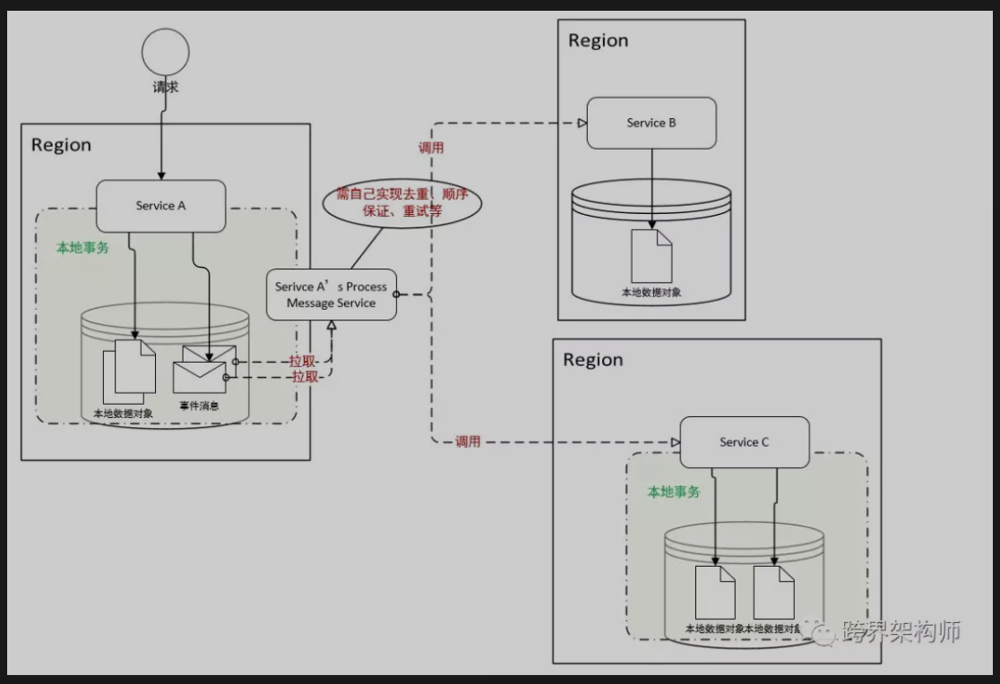
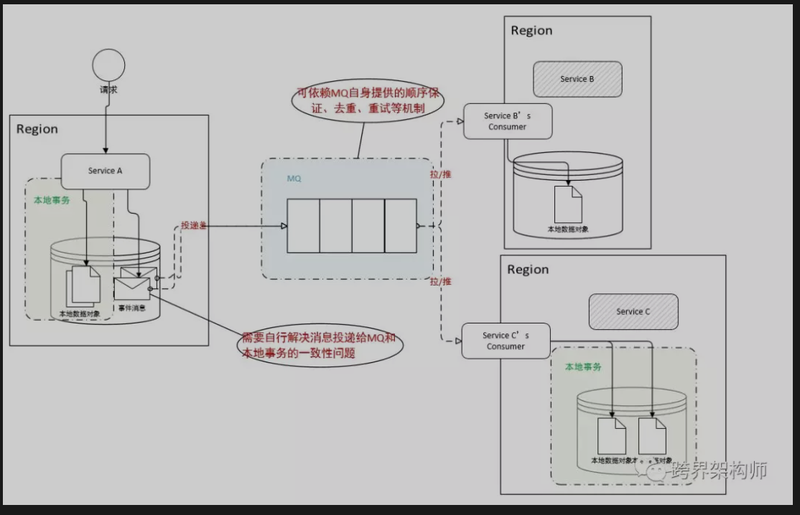
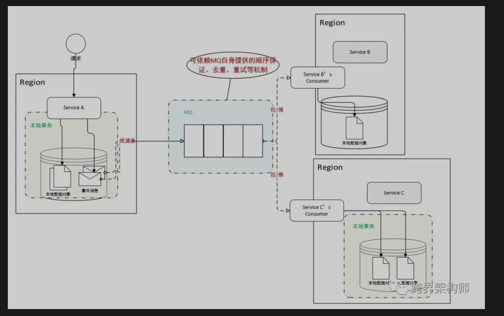
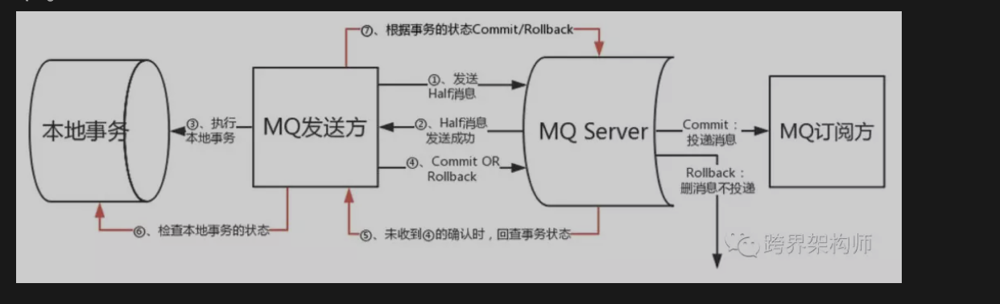
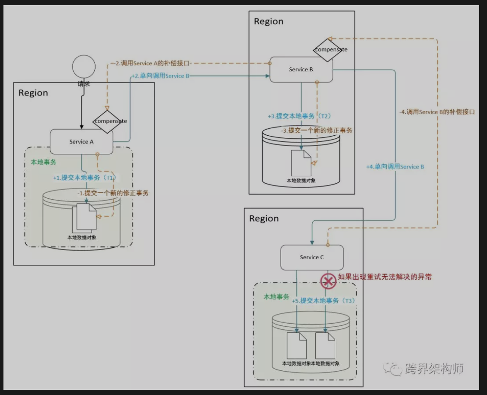

### 异步消息  --- 本地消息表



- 设计思想是将远程分布式事务拆分成一系列的本地事务，借助关系型数据库中的表即可实现。 

### 异步消息 --- 不支持事务的MQ



其实大部分的MQ都是不支持事务的，所以我们需要自己想办法解决可能出现的MQ消息未能成功投递出去的问题。有个便宜可以捡的是，如果需投递的MQ消息条数仅有1的话，可以将本地事务的commit放于消息投递之后即可避免此问题。伪代码如下：

````java

try{
    beginTrans();
    modifyLocalData1();
    modifyLocalData2();
    deliverMessageToMQ();
    commitTrans();
}catch(Exception ex){
    rollbackTrans();
}

````
### 异步消息 --- 支持事务的MQ




- 目前唯一支持事务的MQ框架是RockerMQ，并且于近期才开源了事务部分实现，《RocketMQ 4.3正式发布，支持分布式事务》（http://www.infoq.com/cn/news/2018/08/rocketmq-4.3-release）。



### Saga



- 将一个分布式事务拆分为多个本地事务，并且击鼓传花给下一个，不用阻塞本地事务等待响应。且允许嵌套至多一层子事务。

- 除了最后一个参与者之外，都需要定义一个「回滚」接口，便于在遇到无法进行下去的情况下撤销之前上游系统的修改。当然这里的撤销除了Update还可以是冲抵类的操作。

### Gossip协议

这个其实是一个具体的、运用BASE理论实现的协议，借由Cassandra的热火而让更多人知道了。这协议一般会用于**数据复制、P2P拓扑构造、故障探测**等