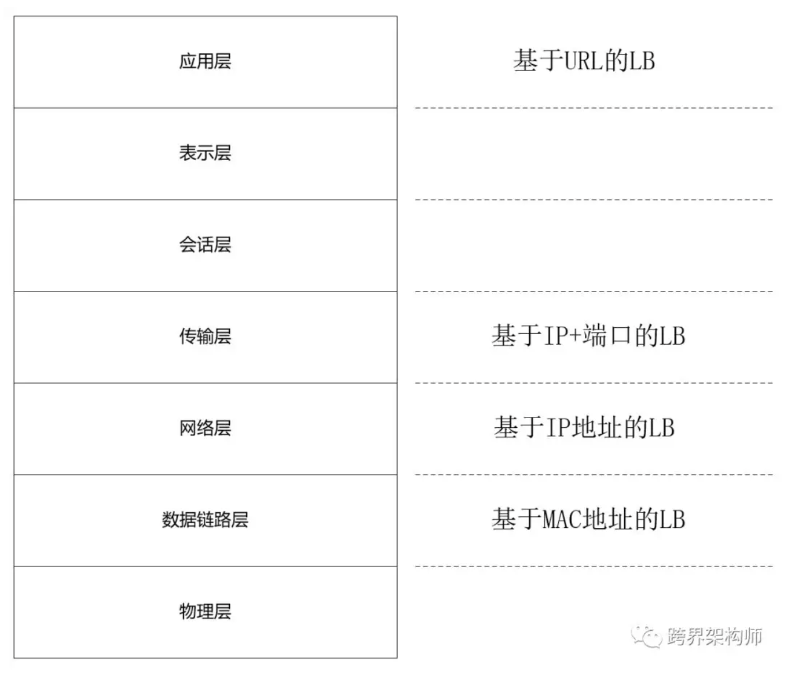
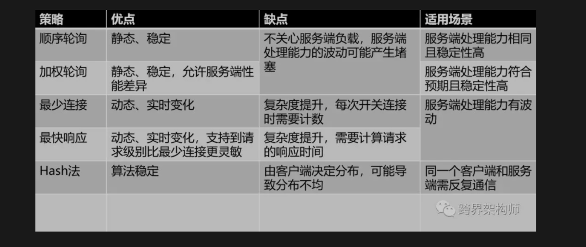
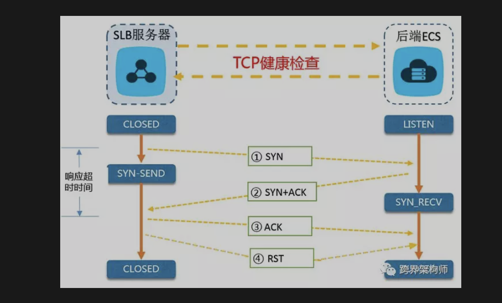
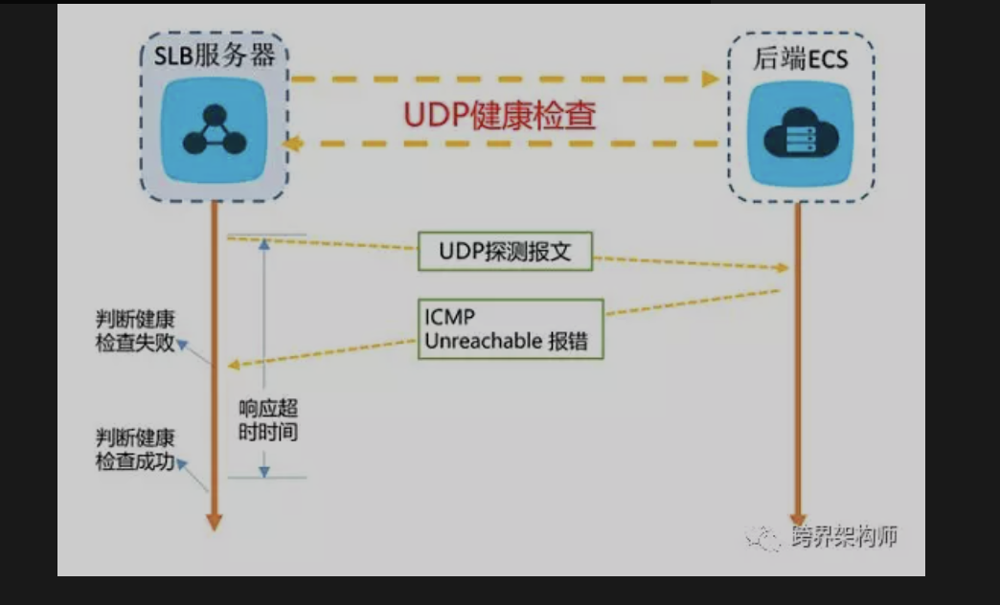

### 高可用

- 更快的发现故障，更快的隔离故障。

### 负载均衡

统一入口来收敛流量，再做二次分发的过程就是负载均衡，它的本质和分布式系统一样，是分治




### 负载均衡策略

#### 轮询

- 这是最常用也最简单策略，平均分配，人人都有、一人一次。大致的代码如下。

- 类似一个数组，依次轮询访问
````java

int  globalIndex = 0;   //注意是全局变量，不是局部变量。

        try

        {

        return servers[globalIndex];

        }

        finally

        {

        globalIndex++;

        if (globalIndex == 3)

        globalIndex = 0;

        }

````

#### 加权轮询

在轮询的基础上，增加了一个权重的概念。权重是一个泛化后的概念，可以用任意方式来体现，本质上是一个能者多劳思想。比如，可以根据宿主的性能差异配置不同的权重。大致的代码如下。

````java
int matchedIndex = -1;

int total = 0;

for (int i = 0; i < servers.Length; i++)

{

      servers[i].cur_weight += servers[i].weight;//①每次循环的时候做自增（步长=权重值）

      total += servers[i].weight;//②将每个节点的权重值累加到汇总值中

      if (matchedIndex == -1 || servers[matchedIndex].cur_weight < servers[i].cur_weight) //③如果 当前节点的自增数 > 当前待返回节点的自增数，则覆盖。

      {

            matchedIndex = i;

      }

}


servers[matchedIndex].cur_weight -= total;//④被选取的节点减去②的汇总值，以降低下一次被选举时的初始权重值。

return servers[matchedIndex];


````

#### 最少连接数

这是一种根据实时的负载情况，进行动态负载均衡的方式。维护好活动中的连接数量，然后取最小的返回即可。大致的代码如下。

``````java
var matchedServer = servers.orderBy(e => e.active_conns).first();

matchedServer.active_conns += 1;

return matchedServer;

//在连接关闭时还需对active_conns做减1的动作。
``````
#### 最快响应

这也是一种动态负载均衡策略，它的本质是根据每个节点对过去一段时间内的响应情况来分配，响应越快分配的越多。具体的运作方式也有很多，上图的这种可以理解为，将最近一段时间的请求耗时的平均值记录下来，结合前面的「加权轮询」来处理，所以等价于2：1：3的加权轮询。

#### Hash法

hash法的负载均衡与之前的几种不同在于，它的结果是由客户端决定的。通过客户端带来的某个标识经过一个标准化的散列函数进行打散分摊。

----
### 负载均衡策略优缺点和适用场景



### 用「健康探测」来保障高可用

#### HTTP探测

使用Get/Post的方式请求服务端的某个固定的URL，判断返回的内容是否符合预期。一般使用Http状态码、response中的内容来判断。

#### TCP探测

基于Tcp的三次握手机制来探测指定的IP + 端口。最佳实践可以借鉴阿里云的SLB机制，如下图。



值得注意的是，为了尽早释放连接，在三次握手结束后立马跟上RST来中断TCP连接。

#### UDP探测

可能有部分应用使用的UDP协议。在此协议下可以通过报文来进行探测指定的IP + 端口。最佳实践同样可以借鉴阿里云的SLB机制，如下图。


结果的判定方式是：在服务端没有返回任何信息的情况下，默认正常状态。否则会返回一个ICMP的报错信息。


