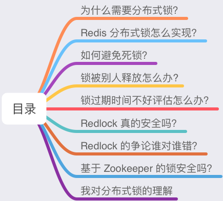
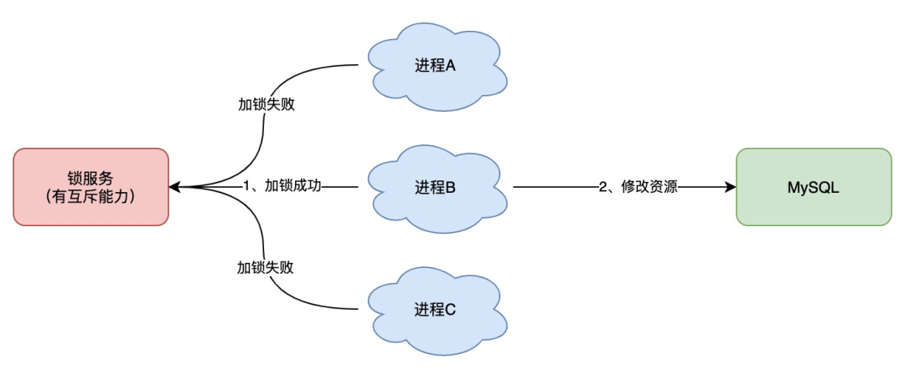
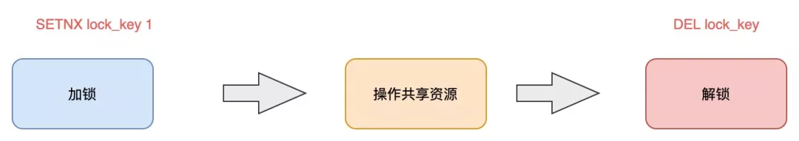
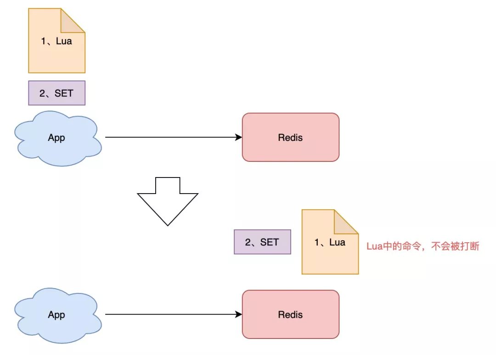
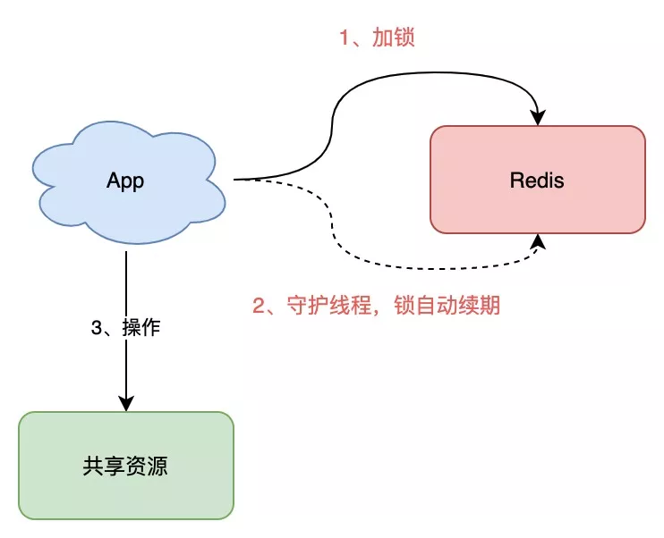
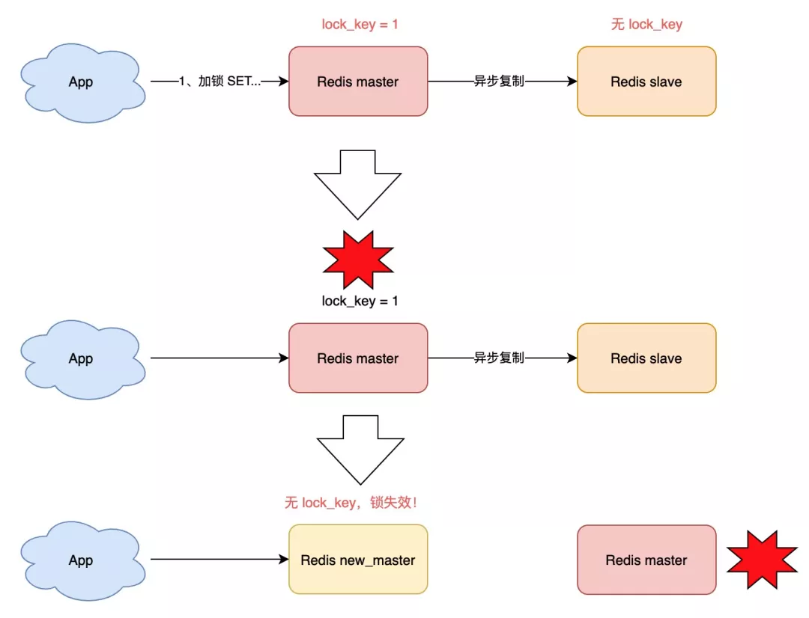
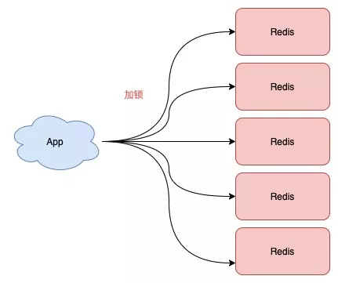
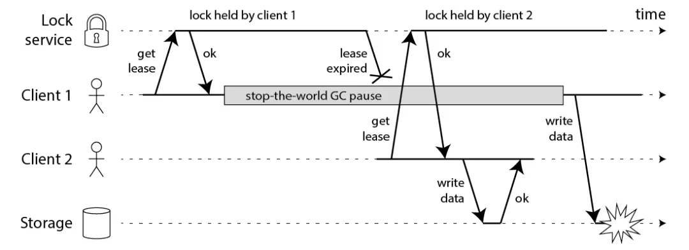
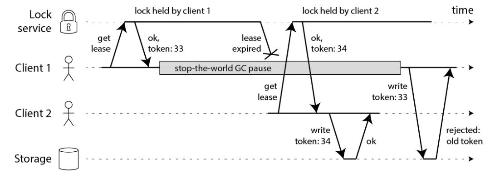
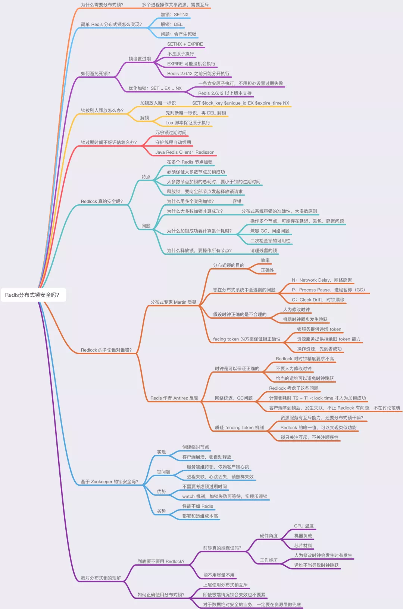

该文章内容来之公众号：水滴与银弹
----
- 基于 Redis 如何实现一个分布式锁？
- Redis 分布式锁真的安全吗？
- Redis 的 Redlock 有什么问题？一定安全吗？
- 业界争论 Redlock，到底在争论什么？哪种观点是对的？
- 分布式锁到底用 Redis 还是 Zookeeper？
- 实现一个有「容错性」的分布式锁，都需要考虑哪些问题？




### 为什么需要分布式锁？ 

在开始讲分布式锁之前，有必要简单介绍一下，为什么需要分布式锁？

- 与分布式锁相对应的是「单机锁」，我们在写多线程程序时，避免同时操作一个共享变量产生数据问题，通常会使用一把锁来「互斥」，以保证共享变量的正确性，其使用范围是在「同一个进程」中。

- 如果换做是多个进程，需要同时操作一个共享资源，如何互斥呢？

- 例如，现在的业务应用通常都是微服务架构，这也意味着一个应用会部署多个进程，那这多个进程如果需要修改 MySQL 中的同一行记录时，为了避免操作乱序导致数据错误，此时，我们就需要引入「分布式锁」来解决这个问题了。



**想要实现分布式锁，必须借助一个外部系统，所有进程都去这个系统上申请「加锁」。**

- 而这个外部系统，必须要实现「互斥」的能力，即两个请求同时进来，只会给一个进程返回成功，另一个返回失败（或等待）。

- 这个外部系统，可以是 MySQL，也可以是 Redis 或 Zookeeper。但为了追求更好的性能，我们通常会选择使用 Redis 或 Zookeeper 来做。

下面我就以 Redis 为主线，由浅入深，带你深度剖析一下，分布式锁的各种「安全性」问题，帮你彻底理解分布式锁。

### 分布式锁怎么实现？

- 想要实现分布式锁，必须要求 Redis 有「互斥」的能力，我们可以使用 `SETNX 命令`，这个命令表示SET if Not EXists，即如果 key 不存在，才会设置它的值，否则什么也不做。

- 两个客户端进程可以执行这个命令，达到互斥，就可以实现一个分布式锁。

- 客户端 1 申请加锁，加锁成功：

````shell
127.0.0.1:6379> SETNX lock 1
(integer) 1     // 客户端1，加锁成功
````
- 客户端 2 申请加锁，因为它后到达，加锁失败：
````shell

127.0.0.1:6379> SETNX lock 1
(integer) 0     // 客户端2,加锁失败
````
- 此时，加锁成功的客户端，就可以去操作「共享资源」，例如，修改 MySQL 的某一行数据，或者调用一个 API 请求。

- **操作完成后，还要及时释放锁，给后来者让出操作共享资源的机会。如何释放锁呢？**

- 也很简单，直接使用 DEL 命令删除这个 key 即可：

````shell
127.0.0.1:6379> DEL lock // 释放锁
(integer) 1
````
- 这个逻辑非常简单，整体的路程就是这样：



但是，它存在一个很大的问题，当客户端 1 拿到锁后，如果发生下面的场景，就会造成「死锁」：

- 程序处理业务逻辑异常，没及时释放锁
- 进程挂了，没机会释放锁
- 这时，这个客户端就会一直占用这个锁，而其它客户端就「永远」拿不到这把锁了。

### 怎么解决这个问题呢？

#### 如何避免死锁？

- 我们很容易想到的方案是，在申请锁时，给这把锁设置一个「租期」。

- 在 Redis 中实现时，就是给这个 key 设置一个「过期时间」。这里我们假设，操作共享资源的时间不会超过 10s，那么在加锁时，给这个 key 设置 10s 过期即可：

````shell
127.0.0.1:6379> SETNX lock 1    // 加锁
(integer) 1
127.0.0.1:6379> EXPIRE lock 10  // 10s后自动过期
(integer) 1
````
这样一来，无论客户端是否异常，这个锁都可以在 10s 后被「自动释放」，其它客户端依旧可以拿到锁。

### 但这样真的没问题吗？

还是有问题。 现在的操作，加锁、设置过期是 2 条命令，有没有可能只执行了第一条，第二条却「来不及」执行的情况发生呢？例如：

- SETNX 执行成功，执行 EXPIRE 时由于网络问题，执行失败
- SETNX 执行成功，Redis 异常宕机，EXPIRE 没有机会执行
- SETNX 执行成功，客户端异常崩溃，EXPIRE 也没有机会执行
总之，这两条命令不能保证是原子操作（一起成功），就有潜在的风险导致过期时间设置失败，依旧发生「死锁」问题。

### 怎么办？ 

- 在 Redis 2.6.12 版本之前，我们需要想尽办法，保证 SETNX 和 EXPIRE 原子性执行，还要考虑各种异常情况如何处理。 但在 Redis 2.6.12 之后，Redis 扩展了 SET 命令的参数，用这一条命令就可以了：

````shell
// 一条命令保证原子性执行
127.0.0.1:6379> SET lock 1 EX 10 NX
OK
````
这样就解决了死锁问题，也比较简单。 

### 我们再来看分析下，它还有什么问题？

试想这样一种场景：

- 客户端 1 加锁成功，开始操作共享资源
- 客户端 1 操作共享资源的时间，「超过」了锁的过期时间，锁被「自动释放」
- 客户端 2 加锁成功，开始操作共享资源
- 客户端 1 操作共享资源完成，释放锁（但释放的是客户端 2 的锁）

### 看到了么，这里存在两个严重的问题：

- **锁过期**：客户端 1 操作共享资源耗时太久，导致锁被自动释放，之后被客户端 2 持有
- **释放别人的锁**：客户端 1 操作共享资源完成后，却又释放了客户端 2 的锁

### 导致这两个问题的原因是什么？我们一个个来看。

#### 第一个问题，可能是我们评估操作共享资源的时间不准确导致的。

例如，操作共享资源的时间「最慢」可能需要 15s，而我们却只设置了 10s 过期，那这就存在锁提前过期的风险。 过期时间太短，那增大冗余时间，例如设置过期时间为 20s，这样总可以了吧？

这样确实可以「缓解」这个问题，降低出问题的概率，但依旧无法「彻底解决」问题。

#### 为什么？

- 原因在于，客户端在拿到锁之后，在操作共享资源时，遇到的场景有可能是很复杂的，例如，程序内部发生异常、网络请求超时等等。 既然是「预估」时间，也只能是大致计算，除非你能预料并覆盖到所有导致耗时变长的场景，但这其实很难。

### 我们继续来看第二个问题。

#### 第二个问题在于，一个客户端释放了其它客户端持有的锁。

想一下，导致这个问题的关键点在哪？ 重点在于，每个客户端在释放锁时，都是「无脑」操作，并没有检查这把锁是否还「归自己持有」，所以就会发生释放别人锁的风险，这样的解锁流程，很不「严谨」！

### 如何解决这个问题呢？

#### 锁被别人释放怎么办?

- 解决办法是：客户端在加锁时，设置一个只有自己知道的「唯一标识」进去。 例如，可以是自己的线程 ID，也可以是一个 UUID（随机且唯一），这里我们以 UUID 举例：

````shell
// 锁的VALUE设置为UUID
127.0.0.1:6379> SET lock $uuid EX 20 NX
OK
````

这里假设 20s 操作共享时间完全足够，先不考虑锁自动过期的问题。

之后，在释放锁时，要先判断这把锁是否还归自己持有，伪代码可以这么写：

````shell
// 锁是自己的，才释放
if redis.get("lock") == $uuid:
redis.del("lock")
````
这里释放锁使用的是 GET + DEL 两条命令，这时，又会遇到我们前面讲的原子性问题了。

- 客户端 1 执行 GET，判断锁是自己的
- 客户端 2 执行了 SET 命令，强制获取到锁（虽然发生概率比较低，但我们需要严谨地考虑锁的安全性模型）
- 客户端 1 执行 DEL，却释放了客户端 2 的锁

由此可见，这两个命令还是必须要原子执行才行。

### 怎样原子执行呢？Lua 脚本。

- 我们可以把这个逻辑，写成 Lua 脚本，让 Redis 来执行。

- 因为 Redis 处理每一个请求是「单线程」执行的，在执行一个 Lua 脚本时，其它请求必须等待，直到这个 Lua 脚本处理完成，这样一来，GET + DEL 之间就不会插入其它命令了。



安全释放锁的 Lua 脚本如下：

````shell
// 判断锁是自己的，才释放
if redis.call("GET",KEYS[1]) == ARGV[1]
  then
    return redis.call("DEL",KEYS[1])
else
    return 0
end
````
好了，这样一路优化，整个的加锁、解锁的流程就更「严谨」了。

### 这里我们先小结一下，基于 Redis 实现的分布式锁，一个严谨的的流程如下：

- 加锁：SET lock_key $unique_id EX $expire_time NX
- 操作共享资源
- 释放锁：Lua 脚本，先 GET 判断锁是否归属自己，再 DEL 释放锁


### 锁过期时间不好评估怎么办？

- 锁过期时间不好评估怎么办？ 前面我们提到，锁的过期时间如果评估不好，这个锁就会有「提前」过期的风险。

- 当时给的妥协方案是，尽量「冗余」过期时间，降低锁提前过期的概率。

###这个方案其实也不能完美解决问题，那怎么办呢？

- 是否可以设计这样的方案：加锁时，先设置一个过期时间，然后我们开启一个 **「守护线程」**，定时去检测这个锁的失效时间，如果锁快要过期了，操作共享资源还未完成，那么就自动对锁进行「续期」，重新设置过期时间。

- 这确实一种比较好的方案。 如果你是 Java 技术栈，幸运的是，已经有一个库把这些工作都封装好了：**Redisson**。

- Redisson 是一个 Java 语言实现的 Redis SDK 客户端，在使用分布式锁时，它就采用了「自动续期」的方案来避免锁过期，这个守护线程我们一般也把它叫做「看门狗」线程。



#### 除此之外，这个 SDK 还封装了很多易用的功能：

- 可重入锁
- 乐观锁
- 公平锁
- 读写锁
- Redlock（红锁，下面会详细讲）

这个 SDK 提供的 API 非常友好，它可以像操作本地锁的方式，操作分布式锁。如果你是 Java 技术栈，可以直接把它用起来。

### 到这里我们再小结一下，基于 Redis 的实现分布式锁，前面遇到的问题，以及对应的解决方案：

- 死锁：设置过期时间
- 过期时间评估不好，锁提前过期：守护线程，自动续期
- 锁被别人释放：锁写入唯一标识，释放锁先检查标识，再释放

### 还有哪些问题场景，会危害 Redis 锁的安全性呢？

- 之前分析的场景都是，锁在「单个」Redis 实例中可能产生的问题，并没有涉及到 Redis 的部署架构细节。

- 而我们在使用 Redis 时，一般会采用 **主从集群 + 哨兵的模式部署**，这样做的好处在于，当主库异常宕机时，哨兵可以实现「故障自动切换」，把从库提升为主库，继续提供服务，以此保证可用性。

### 那当「主从发生切换」时，这个分布锁会依旧安全吗？

试想这样的场景：

- 客户端 1 在主库上执行 SET 命令，加锁成功
- 此时，主库异常宕机，SET 命令还未同步到从库上（主从复制是异步的）
- 从库被哨兵提升为新主库，这个锁在新的主库上，丢失了！


可见，当引入 Redis 副本后，分布锁还是可能会受到影响。

### 怎么解决这个问题？

- 为此，Redis 的作者提出一种解决方案，就是我们经常听到的 Redlock（红锁）。

### Redlock 真的安全吗？

#### Redlock 的方案基于 2 个前提：

- 不再需要部署从库和哨兵实例，只部署主库
- 但主库要部署多个，官方推荐至少 5 个实例

也就是说，想用使用 Redlock，你至少要部署 5 个 Redis 实例，而且都是主库，它们之间没有任何关系，都是一个个孤立的实例。

注意：不是部署 Redis Cluster，就是部署 5 个简单的 Redis 实例。



### Redlock 具体如何使用呢？

#### 整体的流程是这样的，一共分为 5 步：

- 客户端先获取「当前时间戳T1」
- 客户端依次向这 5 个 Redis 实例发起加锁请求（用前面讲到的 SET 命令），且每个请求会设置超时时间（毫秒级，要远小于锁的有效时间），如果某一个实例加锁失败（包括网络超时、锁被其它人持有等各种异常情况），就立即向下一个 Redis 实例申请加锁
- 如果客户端从 >=3 个（大多数）以上 Redis 实例加锁成功，则再次获取「当前时间戳T2」，如果 T2 - T1 < 锁的过期时间，此时，认为客户端加锁成功，否则认为加锁失败
- 加锁成功，去操作共享资源（例如修改 MySQL 某一行，或发起一个 API 请求）
- 加锁失败，向「全部节点」发起释放锁请求（前面讲到的 Lua 脚本释放锁）

#### 我简单帮你总结一下，有 4 个重点：

- 客户端在多个 Redis 实例上申请加锁
- 必须保证大多数节点加锁成功
- 大多数节点加锁的总耗时，要小于锁设置的过期时间
- 释放锁，要向全部节点发起释放锁请求

### 我们来看 Redlock 为什么要这么做。

#### 为什么要在多个实例上加锁？

本质上是为了「容错」，部分实例异常宕机，剩余的实例加锁成功，整个锁服务依旧可用。

#### 为什么大多数加锁成功，才算成功？

- 多个 Redis 实例一起来用，其实就组成了一个「分布式系统」。

- 在分布式系统中，总会出现「异常节点」，所以，在谈论分布式系统问题时，需要考虑异常节点达到多少个，也依旧不会影响整个系统的「正确性」。

- 这是一个分布式系统「容错」问题，这个问题的结论是：如果只存在「故障」节点，只要大多数节点正常，那么整个系统依旧是可以提供正确服务的。

#### 为什么步骤 3 加锁成功后，还要计算加锁的累计耗时？

- 因为操作的是多个节点，所以耗时肯定会比操作单个实例耗时更久，而且，因为是网络请求，网络情况是复杂的，有可能存在延迟、丢包、超时等情况发生，网络请求越多，异常发生的概率就越大。

- 所以，即使大多数节点加锁成功，但如果加锁的累计耗时已经「超过」了锁的过期时间，那此时有些实例上的锁可能已经失效了，这个锁就没有意义了。

#### 为什么释放锁，要操作所有节点？

- 在某一个 Redis 节点加锁时，可能因为「网络原因」导致加锁失败。

例如，客户端在一个 Redis 实例上加锁成功，但在读取响应结果时，网络问题导致读取失败，那这把锁其实已经在 Redis 上加锁成功了。

所以，释放锁时，不管之前有没有加锁成功，需要释放「所有节点」的锁，以保证清理节点上「残留」的锁。


### 但事实真的如此吗？


#### 1) 分布式锁的目的是什么？

Martin 表示，你必须先清楚你在使用分布式锁的目的是什么？ 他认为有两个目的。

- 第一，效率。

使用分布式锁的互斥能力，是避免不必要地做同样的两次工作（例如一些昂贵的计算任务）。如果锁失效，并不会带来「恶性」的后果，例如发了 2 次邮件等，无伤大雅。

- 第二，正确性。

使用锁用来防止并发进程互相干扰。如果锁失效，会造成多个进程同时操作同一条数据，产生的后果是数据严重错误、永久性不一致、数据丢失等恶性问题，就像给患者服用了重复剂量的药物，后果很严重。

他认为，如果你是为了前者——效率，那么使用单机版 Redis 就可以了，即使偶尔发生锁失效（宕机、主从切换），都不会产生严重的后果。而使用 Redlock 太重了，没必要。

而如果是为了正确性，Martin 认为 Redlock 根本达不到安全性的要求，也依旧存在锁失效的问题！

#### 2) 锁在分布式系统中会遇到的问题

这些异常场景主要包括三大块，这也是分布式系统会遇到的三座大山：NPC。

- N：Network Delay，网络延迟
- P：Process Pause，进程暂停（GC）
- C：Clock Drift，时钟漂移

Martin 用一个进程暂停（GC）的例子，指出了 Redlock 安全性问题：

- 客户端 1 请求锁定节点 A、B、C、D、E
- 客户端 1 的拿到锁后，进入 GC（时间比较久）
- 所有 Redis 节点上的锁都过期了
- 客户端 2 获取到了 A、B、C、D、E 上的锁
- 客户端 1 GC 结束，认为成功获取锁
- 客户端 2 也认为获取到了锁，发生「冲突」


Martin 认为，GC 可能发生在程序的任意时刻，而且执行时间是不可控的。

__注：当然，即使是使用没有 GC 的编程语言，在发生网络延迟、时钟漂移时，也都有可能导致 Redlock 出现问题，这里 Martin 只是拿 GC 举例。__

#### 3) 假设时钟正确的是不合理的

又或者，当多个 Redis 节点「时钟」发生问题时，也会导致 Redlock 锁失效。

- 客户端 1 获取节点 A、B、C 上的锁，但由于网络问题，无法访问 D 和 E
- 节点 C 上的时钟「向前跳跃」，导致锁到期
- 客户端 2 获取节点 C、D、E 上的锁，由于网络问题，无法访问 A 和 B
- 客户端 1 和 2 现在都相信它们持有了锁（冲突）
- Martin 觉得，Redlock 必须「强依赖」多个节点的时钟是保持同步的，一旦有节点时钟发生错误，那这个算法模型就失效了。
- 即使 C 不是时钟跳跃，而是「崩溃后立即重启」，也会发生类似的问题。

Martin 继续阐述，机器的时钟发生错误，是很有可能发生的：

- 系统管理员「手动修改」了机器时钟
- 机器时钟在同步 NTP 时间时，发生了大的「跳跃」
- 总之，Martin 认为，Redlock 的算法是建立在「同步模型」基础上的，有大量资料研究表明，同步模型的假设，在分布式系统中是有问题的。

在混乱的分布式系统的中，你不能假设系统时钟就是对的，所以，你必须非常小心你的假设。

#### 4) 提出 fecing token 的方案，保证正确性

相对应的，Martin 提出一种被叫作 fecing token 的方案，保证分布式锁的正确性。

#### 这个模型流程如下：

- 客户端在获取锁时，锁服务可以提供一个「递增」的 token
- 客户端拿着这个 token 去操作共享资源
- 共享资源可以根据 token 拒绝「后来者」的请求

  
这样一来，无论 NPC 哪种异常情况发生，都可以保证分布式锁的安全性，因为它是建立在「异步模型」上的。

而 Redlock 无法提供类似 fecing token 的方案，所以它无法保证安全性。

他还表示，一个好的分布式锁，无论 NPC 怎么发生，可以不在规定时间内给出结果，但并不会给出一个错误的结果。也就是只会影响到锁的「性能」（或称之为活性），而不会影响它的「正确性」。

#### Martin 的结论：

- 1、Redlock 不伦不类：它对于效率来讲，Redlock 比较重，没必要这么做，而对于正确性来说，Redlock 是不够安全的。

- 2、时钟假设不合理：该算法对系统时钟做出了危险的假设（假设多个节点机器时钟都是一致的），如果不满足这些假设，锁就会失效。

- 3、无法保证正确性：Redlock 不能提供类似 fencing token 的方案，所以解决不了正确性的问题。为了正确性，请使用有「共识系统」的软件，例如 Zookeeper。


#### Redis 作者 Antirez 的反驳

在 Redis 作者的文章中，重点有 3 个：

#### 1) 解释时钟问题

首先，Redis 作者一眼就看穿了对方提出的最为核心的问题：时钟问题。

Redis 作者表示，Redlock 并不需要完全一致的时钟，只需要大体一致就可以了，允许有「误差」。

例如要计时 5s，但实际可能记了 4.5s，之后又记了 5.5s，有一定误差，但只要不超过「误差范围」锁失效时间即可，这种对于时钟的精度要求并不是很高，而且这也符合现实环境。

对于对方提到的「时钟修改」问题，Redis 作者反驳到：

- 手动修改时钟：不要这么做就好了，否则你直接修改 Raft 日志，那 Raft 也会无法工作...
- 时钟跳跃：通过「恰当的运维」，保证机器时钟不会大幅度跳跃（每次通过微小的调整来完成），实际上这是可以做到的
为什么 Redis 作者优先解释时钟问题？因为在后面的反驳过程中，需要依赖这个基础做进一步解释。

#### 2) 解释网络延迟、GC 问题

之后，Redis 作者对于对方提出的，网络延迟、进程 GC 可能导致 Redlock 失效的问题，也做了反驳：

我们重新回顾一下，Martin 提出的问题假设：

- 客户端 1 请求锁定节点 A、B、C、D、E
- 客户端 1 的拿到锁后，进入 GC
- 所有 Redis 节点上的锁都过期了
- 客户端 2 获取节点 A、B、C、D、E 上的锁
- 客户端 1 GC 结束，认为成功获取锁
- 客户端 2 也认为获取到锁，发生「冲突」

Redis 作者反驳到，这个假设其实是有问题的，Redlock 是可以保证锁安全的。

这是怎么回事呢？

还记得前面介绍 Redlock 流程的那 5 步吗？这里我再拿过来让你复习一下。

- 客户端先获取「当前时间戳T1」
- 客户端依次向这 5 个 Redis 实例发起加锁请求（用前面讲到的 SET 命令），且每个请求会设置超时时间（毫秒级，要远小于锁的有效时间），如果某一个实例加锁失败（包括网络超时、锁被其它人持有等各种异常情况），就立即向下一个 Redis 实例申请加锁
- 如果客户端从 3 个（大多数）以上 Redis 实例加锁成功，则再次获取「当前时间戳T2」，如果 T2 - T1 < 锁的过期时间，此时，认为客户端加锁成功，否则认为加锁失败
- 加锁成功，去操作共享资源（例如修改 MySQL 某一行，或发起一个 API 请求）
- 加锁失败，向「全部节点」发起释放锁请求（前面讲到的 Lua 脚本释放锁）
- 注意，重点是 1-3，在步骤 3，加锁成功后为什么要重新获取「当前时间戳T2」？还用 T2 - T1 的时间，与锁的过期时间做比较？

`Redis 作者强调：如果在 1-3 发生了网络延迟、进程 GC 等耗时长的异常情况，那在第 3 步 T2 - T1，是可以检测出来的，如果超出了锁设置的过期时间，那这时就认为加锁会失败，之后释放所有节点的锁就好了！`

`Redis 作者继续论述，如果对方认为，发生网络延迟、进程 GC 是在步骤 3 之后，也就是客户端确认拿到了锁，去操作共享资源的途中发生了问题，导致锁失效，那这不止是 Redlock 的问题，任何其它锁服务例如 Zookeeper，都有类似的问题，这不在讨论范畴内`。

这里我举个例子解释一下这个问题：

- 客户端通过 Redlock 成功获取到锁（通过了大多数节点加锁成功、加锁耗时检查逻辑）
- 客户端开始操作共享资源，此时发生网络延迟、进程 GC 等耗时很长的情况
- 此时，锁过期自动释放
- 客户端开始操作 MySQL（此时的锁可能会被别人拿到，锁失效）

#### Redis 作者这里的结论就是：

- 客户端在拿到锁之前，无论经历什么耗时长问题，Redlock 都能够在第 3 步检测出来
- 客户端在拿到锁之后，发生 NPC，那 Redlock、Zookeeper 都无能为力
- 所以，Redis 作者认为 Redlock 在保证时钟正确的基础上，是可以保证正确性的。

#### 3) 质疑 fencing token 机制

Redis 作者对于对方提出的 fecing token 机制，也提出了质疑，主要分为 2 个问题，这里最不宜理解，请跟紧我的思路。

- 第一，这个方案必须要求要操作的「共享资源服务器」有拒绝「旧 token」的能力。

例如，要操作 MySQL，从锁服务拿到一个递增数字的 token，然后客户端要带着这个 token 去改 MySQL 的某一行，这就需要利用 MySQL 的「事物隔离性」来做。

// 两个客户端必须利用事物和隔离性达到目的
// 注意 token 的判断条件
UPDATE table T SET val = $new_val WHERE id = $id AND current_token < $token
但如果操作的不是 MySQL 呢？例如向磁盘上写一个文件，或发起一个 HTTP 请求，那这个方案就无能为力了，这对要操作的资源服务器，提出了更高的要求。

也就是说，大部分要操作的资源服务器，都是没有这种互斥能力的。

再者，既然资源服务器都有了「互斥」能力，那还要分布式锁干什么？

所以，Redis 作者认为这个方案是站不住脚的。

-  第二，退一步讲，即使 Redlock 没有提供 fecing token 的能力，但 Redlock 已经提供了随机值（就是前面讲的 UUID），利用这个随机值，也可以达到与 fecing token 同样的效果。

#### 如何做呢？

- 客户端使用 Redlock 拿到锁
- 客户端在操作共享资源之前，先把这个锁的 VALUE，在要操作的共享资源上做标记
- 客户端处理业务逻辑，最后，在修改共享资源时，判断这个标记是否与之前一样，一样才修改（类似 CAS 的思路）

还是以 MySQL 为例，举个例子就是这样的：

- 客户端使用 Redlock 拿到锁
- 客户端要修改 MySQL 表中的某一行数据之前，先把锁的 VALUE 更新到这一行的某个字段中（这里假设为 current_token 字段)
- 客户端处理业务逻辑
- 客户端修改 MySQL 的这一行数据，把 VALUE 当做 WHERE 条件，再修改
````sql
UPDATE table T SET val = $new_val WHERE id = $id AND current_token = $redlock_value
  
````
可见，这种方案依赖 MySQL 的事物机制，也达到对方提到的 fecing token 一样的效果。

但这里还有个小问题，是网友参与问题讨论时提出的：两个客户端通过这种方案，先「标记」再「检查+修改」共享资源，那这两个客户端的操作顺序无法保证啊？

而用 Martin 提到的 fecing token，因为这个 token 是单调递增的数字，资源服务器可以拒绝小的 token 请求，保证了操作的「顺序性」！

Redis 作者对这问题做了不同的解释，我觉得很有道理，他解释道：分布式锁的本质，是为了「互斥」，只要能保证两个客户端在并发时，一个成功，一个失败就好了，不需要关心「顺序性」。

前面 Martin 的质疑中，一直很关心这个顺序性问题，但 Redis 的作者的看法却不同。

#### 综上，Redis 作者的结论：

- 1、作者同意对方关于「时钟跳跃」对 Redlock 的影响，但认为时钟跳跃是可以避免的，取决于基础设施和运维。

- 2、Redlock 在设计时，充分考虑了 NPC 问题，在 Redlock 步骤 3 之前出现 NPC，可以保证锁的正确性，但在步骤 3 之后发生 NPC，不止是 Redlock 有问题，其它分布式锁服务同样也有问题，所以不在讨论范畴内。

-----
### 基于 Zookeeper 的锁安全吗？

如果你有了解过 Zookeeper，基于它实现的分布式锁是这样的：

- 客户端 1 和 2 都尝试创建「临时节点」，例如 /lock
- 假设客户端 1 先到达，则加锁成功，客户端 2 加锁失败
- 客户端 1 操作共享资源
- 客户端 1 删除 /lock 节点，释放锁

你应该也看到了，Zookeeper 不像 Redis 那样，需要考虑锁的过期时间问题，它是采用了「临时节点」，保证客户端 1 拿到锁后，只要连接不断，就可以一直持有锁。

而且，如果客户端 1 异常崩溃了，那么这个临时节点会自动删除，保证了锁一定会被释放。

不错，没有锁过期的烦恼，还能在异常时自动释放锁，是不是觉得很完美？

其实不然。

思考一下，客户端 1 创建临时节点后，Zookeeper 是如何保证让这个客户端一直持有锁呢？

原因就在于，客户端 1 此时会与 Zookeeper 服务器维护一个 Session，这个 Session 会依赖客户端「定时心跳」来维持连接。

如果 Zookeeper 长时间收不到客户端的心跳，就认为这个 Session 过期了，也会把这个临时节点删除。

图片
同样地，基于此问题，我们也讨论一下 GC 问题对 Zookeeper 的锁有何影响：

客户端 1 创建临时节点 /lock 成功，拿到了锁
客户端 1 发生长时间 GC
客户端 1 无法给 Zookeeper 发送心跳，Zookeeper 把临时节点「删除」
客户端 2 创建临时节点 /lock 成功，拿到了锁
客户端 1 GC 结束，它仍然认为自己持有锁（冲突）
可见，即使是使用 Zookeeper，也无法保证进程 GC、网络延迟异常场景下的安全性。

这就是前面 Redis 作者在反驳的文章中提到的：如果客户端已经拿到了锁，但客户端与锁服务器发生「失联」（例如 GC），那不止 Redlock 有问题，其它锁服务都有类似的问题，Zookeeper 也是一样！

所以，这里我们就能得出结论了：一个分布式锁，在极端情况下，不一定是安全的。

如果你的业务数据非常敏感，在使用分布式锁时，一定要注意这个问题，不能假设分布式锁 100% 安全。

好，现在我们来总结一下 Zookeeper 在使用分布式锁时优劣：

Zookeeper 的优点：

不需要考虑锁的过期时间
watch 机制，加锁失败，可以 watch 等待锁释放，实现乐观锁
但它的劣势是：

性能不如 Redis
部署和运维成本高
客户端与 Zookeeper 的长时间失联，锁被释放问题
我对分布式锁的理解

好了，前面详细介绍了基于 Redis 的 Redlock 和 Zookeeper 实现的分布锁，在各种异常情况下的安全性问题，下面我想和你聊一聊我的看法，仅供参考，不喜勿喷。

1) 到底要不要用 Redlock？

前面也分析了，Redlock 只有建立在「时钟正确」的前提下，才能正常工作，如果你可以保证这个前提，那么可以拿来使用。

但保证时钟正确，我认为并不是你想的那么简单就能做到的。

第一，从硬件角度来说，时钟发生偏移是时有发生，无法避免。

例如，CPU 温度、机器负载、芯片材料都是有可能导致时钟发生偏移的。

第二，从我的工作经历来说，曾经就遇到过时钟错误、运维暴力修改时钟的情况发生，进而影响了系统的正确性，所以，人为错误也是很难完全避免的。

所以，我对 Redlock 的个人看法是，尽量不用它，而且它的性能不如单机版 Redis，部署成本也高，我还是会优先考虑使用主从+ 哨兵的模式 实现分布式锁。

那正确性如何保证呢？第二点给你答案。

2) 如何正确使用分布式锁？

在分析 Martin 观点时，它提到了 fecing token 的方案，给我了很大的启发，虽然这种方案有很大的局限性，但对于保证「正确性」的场景，是一个非常好的思路。

所以，我们可以把这两者结合起来用：

1、使用分布式锁，在上层完成「互斥」目的，虽然极端情况下锁会失效，但它可以最大程度把并发请求阻挡在最上层，减轻操作资源层的压力。

2、但对于要求数据绝对正确的业务，在资源层一定要做好「兜底」，设计思路可以借鉴 fecing token 的方案来做。

两种思路结合，我认为对于大多数业务场景，已经可以满足要求了。


从最简单分布式锁的实现，到处理各种异常场景，再到引出 Redlock，以及两个分布式专家的辩论，得出了 Redlock 的适用场景。

最后，我们还对比了 Zookeeper 在做分布式锁时，可能会遇到的问题，以及与 Redis 的差异。

这里我把这些内容总结成了思维导图，方便你理解。




