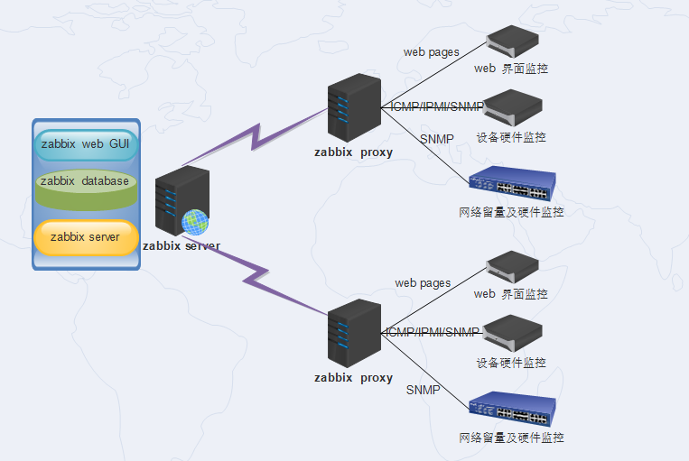
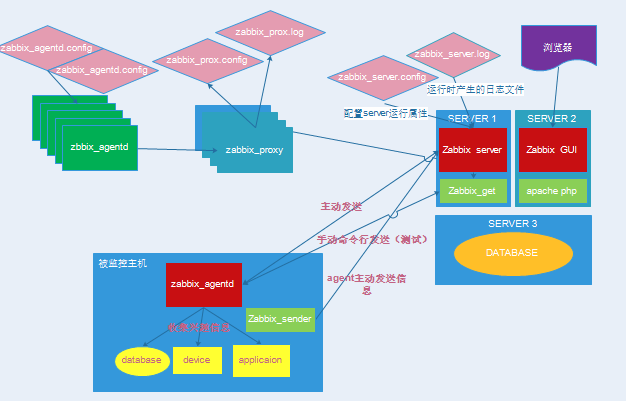
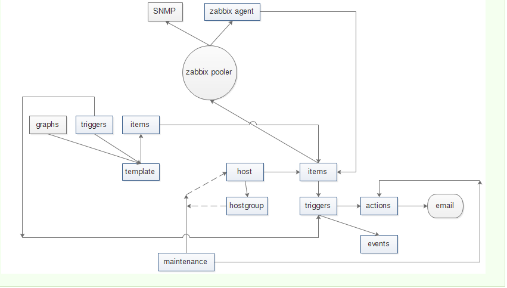
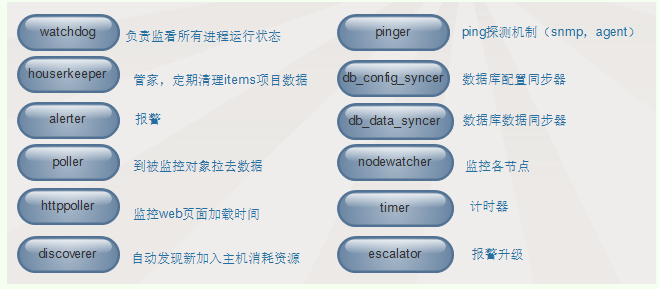

### zabbix是完全开源的工具，整合了cacti和nagios等特性。

- zabbix功能很强大，如何理解zabbix的功能，我们可以和cacti、nagios的功能对比一下：

- cacti是一款数据采集，数据存储，外加web界面展示的工具，它负责阈值范围内的实时变化，但是对超过阈值的告警功能很薄弱

  - 优点：实时监控数据变化，以web页面的方式呈现，更直观。

  - 缺点：告警不及时

- nagios是一款告警功能很强大的工具，它不关心阈值范围内的变化，只关心状态变化（超过阈值），然后报警。报警方式通过邮件，短信等。

  - 优点：告警反映迅速。

  - 缺点：监控主机数量有限，承载低

- __zabbix    =   cacti   +  nagios__

  - 优点：基于两款工具优点于一身并更强大，实现企业级分布式监控。
    
  - 缺点：2.2版本带宽占用大但是升级到2.4版本后更节省了带宽资源，其它再无发现。
    
------

### zabbix监控功能的实现

- 监控主机 zabbix 有专业的agent,可以监控Linux、Windows等
- 监控网络设备zabbix 通过 SNMP、ssh 
#### 可监控的对象
- 设备：服务器、路由器、交换机
- 软件：OS、网络、应用程序
- 主机性能指标监控
- 故障监控：down机，服务不可用、主机不可大
#### 支持数据库存储类型
- zabbix-database: MySQL, PGSQL(postgreSQL)、Oracle、DB2、SQLite
#### Zabbix架构中的组件

- zabbix-server :C语言
- zabbix-agent:C语言
- zabbix-web:GUI，用于实现zabbix设定和展示，php
- zabbix-proxy:分布式监控环境中的专用组件

### 监控流程

一个监控系统运行的大概的流程是这样的：

`agentd`需要安装到被监控的主机上，它负责定期收集各项数据，并发送到`zabbix server端`，`zabbix server`将数据存储到数据库中，`zabbix web`根据数据在前端进行展现和绘图。这里`agentd收集数据`分为主动和被动两种模式：

- 主动：agent 请求server获取主动的监控项列表，并主动将监控项内需要检测的数据交给server/proxy
- 被动：server向agent请求获取监控项的数据，agent返回数据

### 主动监控通信过程如下：

zabbix首先向ServerActive配置的IP请求获取active items，获取并提交`active tiems`数据值server或者proxy。
很多人会提出疑问：zabbix多久获取一次active items？它会根据配置文件中的`RefreshActiveChecks`的频率进行，如果获取失败，那么将会在60秒之后重试。分两个部分：

#### 获取ACTIVE ITEMS列表

- Agent打开TCP连接（主动检测变成Agent打开）
- Agent请求items检测列表
- Server返回items列表
- Agent 处理响应
- 关闭TCP连接
- Agent开始收集数据

#### 主动检测提交数据过程如下：

- Agent建立TCP连接
- Agent提交items列表收集的数据
- Server处理数据，并返回响应状态
- 关闭TCP连接

###【被动监测】通信过程如下：

- Server打开一个TCP连接
- Server发送请求agent.ping
- Agent接收到请求并且响应<HEADER><DATALEN>1
- Server处理接收到的数据1
- 关闭TCP连接

### 那实际监控中是用主动的还是被动的呢？这里主要涉及两个地方：

- 新建监控项目时，选择的是zabbix代理还是zabbix端点代理程式（主动式），前者是被动模式，后者是主动模式。

- agentd配置文件中StartAgents参数的设置，如果为0，表示禁止被动模式，否则开启。一般建议不要设置为0，因为监控项目很多时，可以部分使用主动，部分使用被动模式。

## 常用的监控架构平台

- __server-agentd模式__：

这个是最简单的架构了，常用于监控主机比较少的情况下。

- __server-proxy-agentd模式__：

这个常用于比较多的机器，使用proxy进行分布式监控，有效的减轻server端的压力。

## Zabbix逻辑架构

- 定义一个template模板，里面包括多个items，trigger，graphs套用给host或者hostgroups。

- server监控项目items通过zabbix poller进程（可以有多个进程实现并发处理）包括snmp，agent协议收集被监控主机信息。

- 如果阈值超过triggers触发器规定，就是形成一个events事件，然后actions处理动作（包括运行预先定制的脚本，不成功发送email或SMS）。

- 在服务器升级的时候提前设定maintenance维护模式不对服务器产生告警通知。
  

### Zabbix Server启动后都有那些进程？

