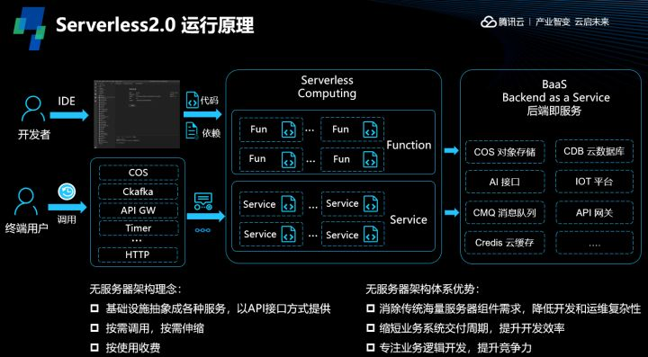
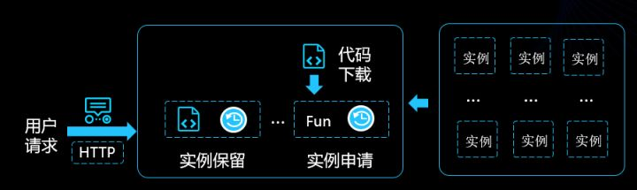

### serverless原理

- 开发者在实际使用时，可以借助 Web IDE 或者本地 IDE 完成代码开发，然后通过插件、工具等方式把代码及其相关依赖，一起打包部署到云函数平台，用户可以自行选择部署为函数形态或者服务形态。

- 在代码里，用户需要自己实现业务逻辑，比如访问数据库、对象存储、消息队列、第三方服务接口等。计算逻辑和后端服务共同构成了所谓的 Serverless 应用架构。而终端用户根据平台提供的请求方式，去触发部署在云函数平台上的业务代码，比如发送 http 请求，平台会根据用户的请求量去拉起相应的计算资源运行用户代码。

#### 这里需要重点关注函数形态和服务形态的差异，因为服务的形态可以大大降低复杂业务迁移的成本。
- 服务形态支持直接部署基于框架开发的核心业务，如 Node.js 的 express、koa 等框架，不用为了应用 Serverless 而拆分成函数。平台会帮用户启动服务进程、端口监听，同时服务形态不会限制业务的实际运行时长。
- 函数形态和服务形态在收到用户请求的时候，均能实现自动扩缩。
- 函数形态会针对用户的每个请求都分配一个运行实例，因此所有请求的执行体验是一样的。当没有请求的时候，平台是没有实例在运行的，所以可以做到按需请求，但是这也会造成所谓的冷启动 —— 即当用户的首次请求进入平台的时候，平台会临时拉起资源，而这个过程会消耗一定的时间。为了消除冷启，云函数平台会预先初始化一批不同规格的实例放在资源池中，当用户有请求进入时，可以快速从资源池申请一个实例，直接挂载用户的代码运行，从而降低了资源申请时间。同时，针对函数形态，平台会根据历史并发数据进行预测，帮用户预留一定量的实例，这些实例会预先分配到用户的账号下并且加载好了用户的代码，从而不仅直接消除了冷启，也增加了实例复用几率。
- 而服务形态可以至少帮用户预留一个常驻实例，并且把用户的所有请求都投递到首个实例，根据实例的使用情况，自动的动态扩缩。

- 函数形态更适合新建项目，可以敏捷迭代，业务按照函数的粒度开发，不仅可以轻松实现云上多产品的联动，也可以享受函数的高并发及性能一致体验。服务形态更适合已有项目的迁移、重度复杂业务、需要长时运行的业务。

