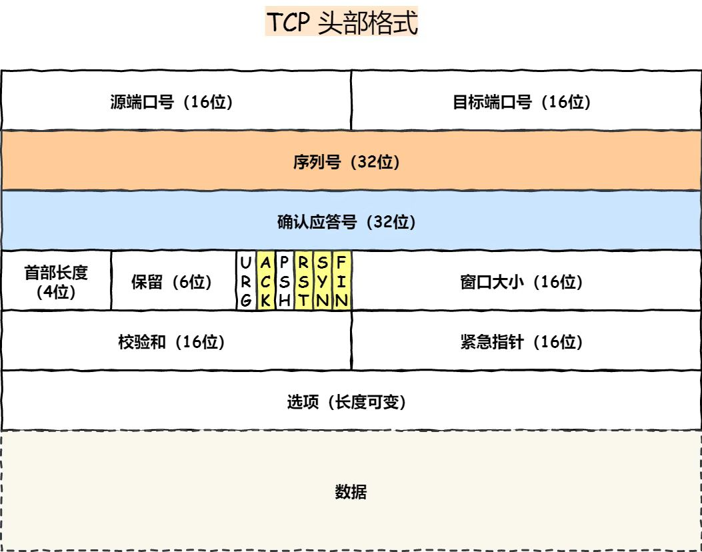

### TCP结构

- 序列号：在建立连接时由计算机生成的随机数作为其初始值，通过 SYN 包传给接收端主机，每发送一次数据，就「累加」一次该「数据字节数」的大小。用来解决网络包乱序问题。

- 确认应答号：指下一次「期望」收到的数据的序列号，发送端收到这个确认应答以后可以认为在这个序号以前的数据都已经被正常接收。用来解决不丢包的问题。”

#### 控制位：

- ACK：该位为 1 时，「确认应答」的字段变为有效，TCP 规定除了最初建立连接时的 SYN 包之外该位必须设置为 1 。

- RST：该位为 1 时，表示 TCP 连接中出现异常必须强制断开连接。

- SYN：该位为 1 时，表示希望建立连接，并在其「序列号」的字段进行序列号初始值的设定。

- FIN：该位为 1 时，表示今后不会再有数据发送，希望断开连接。当通信结束希望断开连接时，通信双方的主机之间就可以相互交换 FIN 位为 1 的 TCP 段。

### 为什么需要TCP

- IP 层是「不可靠」的，它不保证网络包的交付、不保证网络包的按序交付、也不保证网络包中的数据的完整性

- TCP 是一个工作在传输层的可靠数据传输的服务，它能确保接收端接收的网络包是无损坏、无间隔、非冗余和按序的。

### 什么是TCP

- 面向链接、可靠的、基于字节流的传输层通信协议

- 用于保证可靠性和流量控制维护的某些状态信息，这些信息的组合包括：socket、序列号和窗口大小称为链接

### 确定唯一一个TCP

- 四元组：源地址(32位)、源端口(16位)、目标地址、目标端口

- 最大TCP连接数= 客户端ip数✖️客户端端口数
  - 文件描述符限制，socket也是文件，首先通过ulimit配置文件描述符
  - 内存限制，建立链接需要占用一定的内存
    
### TCP和UDP

UDP不提供复杂的控制机制，利用ip提供面向无连接的通信服务

- 连接：tcp是面向连接的传输层协议，传输数据前需要建立连接；udp不需要连接，即刻传输数据
- 服务对象：tcp是一对一的两点服务，即一条连接只有两个端点；udp支持一对一，一对多，多对多的交互通信
- 可靠性：tcp是可靠交付数据的，数据可以无差错、不丢失、不重复、按需到达；udp是尽最大努力交付，不保证可靠交付数据
- 拥塞控制、流量控制：tcp具备拥塞控制和流程控制机制，保证数据传输的安全性；unp则没有，及时网络拥堵，也不影响udp的发送速度；
- 首部开销：tcp首部长度没有"选项"字段时是20个字节，如果使用了则更长，udp只有8个字节固定不变，开销较小
- 传输方式：tcp是流式传输，没有边界，但保证顺序和可靠；udp是一个包一个包的发送，是有边界的，但可能会丢包和乱序
- 分片不同：tcp的数据大小如果大于MSS大小，则会在TCP传输层进行分片，目标主机收到后，同样在传输层组装TCP数据包；UDP数据大小如果大于MSS大小,则在ip层进行分片，目标主机在ip层组装完数据再传给传输层；

### TCP三次握手

- 一开始，客户端和服务端都是CLOSED状态。先是服务端主动监听某个端口，处于LISTEN状态；
- 客户端随机初始化序列号，将此序列号置于TCP首部的【序号】字段中，同时把SYN标识位置为1，表示SYN报文。接着把第一个SYN报文发送给服务端，表示向服务端发起连接，该报文不包含应用层数据，之后客户端处于
SYN_SENT状态；
  
- 服务端收到客户端的SYN报文后，首先服务端也随机初始化自己的序列号，将此序列号填入TCP首部序号字段中，其次把TCP首部的确认应答号字段client_isn+1,接着把SYN和ACK标志位置为1。
  最后把该豹纹发给客户端，该报文也不包含应用层数据，之后服务端处于SYN_RCVD状态;

